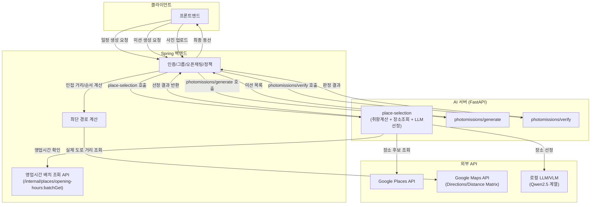

# 단계 3: 서비스 아키텍처 모듈화

## 제출 항목

- ✅ 모듈화 적용 후 새롭게 설계된 서비스 아키텍처 다이어그램 (모델 모듈/서비스와 다른 구성 요소를 명확히 표시)
- ✅ 각 모듈의 책임(domain)과 기능에 대한 설명 (담당하는 기능, 모듈로 분리한 이유)
- ✅ 모듈 간 인터페이스 설계 내용 (API 명세, 데이터 포맷, 통신 방식 등)
- ✅ 모듈화로 기대되는 효과와 장점에 대한 정리 (팀 서비스의 개발 및 운영 측면에서의 이점)
- ✅ 모듈화된 설계의 서비스 시나리오에 부합하다는 점을 설명하는 근거 제시

---

### 서비스 아키텍처 다이어그램



### 모듈 책임(domain)과 기능 설명

| 모듈명             | 엔드포인트                              | 처리 단계                                                                   | 버전    |
| ------------------ | --------------------------------------- | --------------------------------------------------------------------------- | ------- |
| 장소 선정 모듈     | POST /place-selection                   | ① 그룹 취향 판정 → ② 장소 후보 조회 및 필터링 → ③ 장소 선정(LLM)            | v1      |
| 동선 추천 모듈     | POST /course-recommendation             | ① 취향우선 코스(장소 선정+순서, LLM) / ② 외부요인 코스(장소 선정+순서, LLM) | v3 신규 |
| 포토미션 생성 모듈 | POST /photomissions/generate            | ① 미션 문구·유형 생성(LLM) → ② 응답 조립                                    | v1      |
| 포토미션 검증 모듈 | POST /photomissions/{mission_id}/verify | ① 장소/EXIF 사전 확인 → ② 사진 판정(VLM) + 등급 변환                        | v1      |

#### 1. 장소 선정 모듈

**모듈 개요**: 그룹원들의 설문 응답을 바탕으로 여행 일정에 포함할 장소를 선정한다. `POST /place-selection`

**처리 단계 ① 그룹 취향 판정**

담당 기능: 그룹원 개인별 설문 응답을 카테고리별 그룹 대표 점수로 통합한다. 평균이 동점일 경우 분산이 작은 쪽을, 그마저 동점이면 경로 거리가 짧은 쪽을 우선한다.

입력 스키마

```python
class MemberSurvey(BaseModel):
    user_id: str
    survey_result: list[int] = Field(min_length=15, max_length=15)

class PreferenceInput(BaseModel):
    members: list[MemberSurvey]
```

입력 예시

```json
{
  "members": [
    { "user_id": "u_daniel", "survey_result": [4, 3, 5, 2, 2, 3, 5, 4, 5, 1, 1, 2, 3, 3, 4] },
    { "user_id": "u_jiyoung", "survey_result": [5, 5, 4, 3, 2, 3, 2, 2, 1, 1, 1, 1, 2, 2, 3] }
  ]
}
```

출력 스키마

```python
class PreferenceScore(BaseModel):
    category: Literal["HISTORY_CULTURE", "NATURE_HEALING", "FOOD", "ACTIVITY", "CONVENIENCE_SHOPPING"]
    score: float

class GroupPreference(BaseModel):
    scores: list[PreferenceScore]
```

출력 예시

```json
{
  "scores": [
    { "category": "HISTORY_CULTURE", "score": 4.2 },
    { "category": "FOOD", "score": 4.7 }
  ]
}
```

다음 단계와의 연결: `scores`가 ②의 조회 우선순위 기준으로 사용됨

**처리 단계 ② 장소 후보 조회 및 필터링**

담당 기능: 그룹 취향 점수가 높은 카테고리 기준으로 Google Places API를 호출해 후보를 조회하고, 회피 카테고리·영업시간으로 하드 필터링한다.

입력 스키마

```python
class CandidateFetchInput(BaseModel):
    region: str
    preference: GroupPreference
    deal_breakers: list[str]
```

입력 예시

```json
{
  "region": "경주",
  "preference": { "scores": [{ "category": "FOOD", "score": 4.7 }] },
  "deal_breakers": ["시끄러운_곳", "실내_활동"]
}
```

출력 스키마

```python
class CandidatePlace(BaseModel):
    id: str
    displayName: dict
    location: dict
    types: list[str]

class CandidateFetchOutput(BaseModel):
    candidates: list[CandidatePlace]
```

출력 예시

```json
{
  "candidates": [
    {
      "id": "ChIJ...",
      "displayName": { "text": "황남 옥수수빵" },
      "location": { "latitude": 35.8352, "longitude": 129.2103 },
      "types": ["bakery", "cafe"]
    }
  ]
}
```

다음 단계와의 연결: `candidates`가 ③의 후보 목록으로 전달됨

**처리 단계 ③ 장소 선정 (LLM)**

담당 기능: 후보 장소 중 그룹 취향에 맞는 장소를 최종 선정하고, 반영된 카테고리·사용자를 표시한다.

입력 스키마

```python
class SelectionInput(BaseModel):
    preference: GroupPreference
    candidates: list[CandidatePlace]
    must_visit: list[str]
```

입력 예시

```json
{
  "preference": { "scores": [{ "category": "FOOD", "score": 4.7 }] },
  "candidates": [{ "id": "ChIJ...", "displayName": { "text": "황남 옥수수빵" } }],
  "must_visit": ["황리단길"]
}
```

출력 스키마

```python
class SelectedPlace(BaseModel):
    id: str
    displayName: dict
    location: dict
    types: list[str]
    selected_for: list[str]
    matched_preferences: list[str]

class SelectionOutput(BaseModel):
    places: list[SelectedPlace]
```

출력 예시

```json
{
  "places": [
    {
      "id": "ChIJ...",
      "displayName": { "text": "황남 옥수수빵" },
      "location": { "latitude": 35.8352, "longitude": 129.2103 },
      "types": ["bakery"],
      "selected_for": ["u_daniel"],
      "matched_preferences": ["FOOD"]
    }
  ]
}
```

다음 모듈과의 연결: 이 출력이 `place-selection` 엔드포인트 최종 응답(`data.places`)이 되어 Spring으로 전달됨

---

#### 2. 동선 추천 모듈

**모듈 개요**: v3 신규. 확정된 장소 후보를 바탕으로 취향우선 코스와 외부요인우선 코스, 두 가지 경로안을 생성한다. 최단거리 코스(1안)는 Spring이 별도로 계산하며 이 모듈의 범위가 아니다. `POST /route-recommendation`

**처리 단계 ① 취향우선 코스 계산 (LLM)**

담당 기능: 그룹 취향 점수와 후보 장소 목록을 바탕으로, 취향 적합도가 가장 높은 장소 조합과 방문 순서를 선정한다.

입력 스키마

```python
class PreferenceRouteInput(BaseModel):
    preference: GroupPreference
    candidates: list[CandidatePlace]
    must_visit: list[str]
    fixed_waypoints: list[str]  # 동선 편집 시 그룹장이 추가한 장소(고정 경유점)
```

입력 예시

```json
{
  "preference": { "scores": [{ "category": "FOOD", "score": 4.7 }] },
  "candidates": [{ "id": "ChIJ...", "displayName": { "text": "황남 옥수수빵" } }],
  "must_visit": ["황리단길"],
  "fixed_waypoints": []
}
```

출력 스키마

```python
class RoutePlace(BaseModel):
    id: str
    displayName: dict
    location: dict
    types: list[str]
    selected_for: list[str]
    matched_preferences: list[str]
    order: int

class PreferenceRouteOutput(BaseModel):
    course_type: Literal["preference"]
    places: list[RoutePlace]
```

출력 예시

```json
{
  "course_type": "preference",
  "places": [
    {
      "id": "ChIJ...",
      "displayName": { "text": "황남 옥수수빵" },
      "location": { "latitude": 35.8352, "longitude": 129.2103 },
      "types": ["bakery"],
      "selected_for": ["u_daniel"],
      "matched_preferences": ["FOOD"],
      "order": 1
    }
  ]
}
```

다음 단계와의 연결: 별도 없음(독립 실행, ②와 동시 계산)

**처리 단계 ② 외부요인 코스 계산 (LLM)**

담당 기능: 날씨·혼잡도·운영시간 등 외부 변수를 우선 반영해, 문제되는 장소를 배제하고 안전한 조합으로 장소와 순서를 선정한다.

입력 스키마

```python
class ExternalFactor(BaseModel):
    place_id: str
    weather_risk: bool
    congestion_level: Literal["low", "medium", "high"]

class ExternalRouteInput(BaseModel):
    candidates: list[CandidatePlace]
    external_factors: list[ExternalFactor]
    must_visit: list[str]
    fixed_waypoints: list[str]
```

입력 예시

```json
{
  "candidates": [{ "id": "ChIJ...", "displayName": { "text": "첨성대" } }],
  "external_factors": [
    { "place_id": "ChIJ...", "weather_risk": false, "congestion_level": "medium" }
  ],
  "must_visit": [],
  "fixed_waypoints": []
}
```

출력 스키마

```python
class ExternalRouteOutput(BaseModel):
    course_type: Literal["external"]
    places: list[RoutePlace]
```

출력 예시

```json
{
  "course_type": "external",
  "places": [
    {
      "id": "ChIJ...",
      "displayName": { "text": "첨성대" },
      "location": { "latitude": 35.8347, "longitude": 129.2192 },
      "types": ["tourist_attraction"],
      "selected_for": [],
      "matched_preferences": [],
      "order": 1
    }
  ]
}
```

다음 모듈과의 연결: ①, ②의 출력과 Spring이 계산한 1안(최단거리)이 함께 경로 추천 페이지의 3개 카드로 프론트에 전달됨

**재계산 시나리오 반영**

여행 동선 페이지에서 그룹장이 장소를 추가하면, 그 장소는 `fixed_waypoints`(user_id 없는 그룹 공용 고정 경유점)로 처리되어 재계산 시 반드시 경로에 포함되며, 기존 선정 로직(취향/외부요인 판단)은 다시 실행되지 않고 순서만 재조정된다.

---

#### 3. 포토미션 생성 모듈

**모듈 개요**: 확정된 동선을 바탕으로, 각 장소에서 수행할 포토미션을 생성한다. `POST /photomissions/generate`

**처리 단계 ① 미션 문구·유형 생성 (LLM)**

담당 기능: 장소명과 반영된 취향을 받아, 미션 문구(`description`)와 완료 방식(`scope`)을 한 번의 호출로 함께 정한다. 장소가 여러 개면 장소별 호출을 동시에 실행한다.

입력 스키마
```python
class MissionGenInput(BaseModel):
    id: str
    displayName: dict
    matched_preferences: list[str]  # 빈 배열 허용
```

- 필드명은 1단계 요청(`MissionPlace`)과 같다. 엔드포인트가 받은 값을 이름 변환 없이 그대로 이 단계로 넘긴다.
- `displayName`: 문구에는 `displayName.text`만 쓴다. 객체 형태를 유지하는 것은 `place-selection` 응답 원본을 그대로 전달한다는 원칙에 따른 것이다.
- `matched_preferences`: 어떤 취향으로 선정된 장소인지 미션의 소재를 정하는 데 쓴다(`FOOD`면 음식 사진, `HISTORY_CULTURE`면 건축물·유적 사진 등). 빈 배열이면 장소 자체를 소재로 한 일반 미션을 만든다.

입력 예시
```json
{
  "id": "ChIJq6q6q6q6q6qRZ0000000000",
  "displayName": { "text": "황리단길", "languageCode": "ko" },
  "matched_preferences": ["HISTORY_CULTURE"]
}
```

출력 스키마
```python
class MissionDescription(BaseModel):
    description: str
    scope: Literal["PERSONAL", "GROUP"]
```

출력 예시
```json
{ "description": "각자 마음에 드는 한옥 지붕 디테일 하나씩 담기", "scope": "PERSONAL" }
```

`scope` 판정 기준: 한 사람이 낸 사진이 다른 사람 몫을 대신할 수 있는가 하나만 본다.

| `scope` | 완료 방식 (백엔드 기준) | 해당하는 미션 |
|---|---|---|
| `GROUP` | 대표 사진 한 장이면 전원 완료 | 건물·풍경처럼 누가 찍어도 같은 대상 (예: 다 같이 능선을 배경으로 사진 찍기) |
| `PERSONAL` | 각자 자기 사진을 제출해야 완료 | 사람마다 답이 달라야 의미 있는 미션 (예: 각자 인상적인 기와 무늬 하나씩 담기) |

> 설계 당시에는 `selected_for` 인원 수로 규칙 판정했다(1명이면 `individual`, 그 외 `group`). 구현하면서 백엔드 명세를 확인해 보니 `scope`는 위 표처럼 완료 처리 방식을 가르는 값이었는데, `selected_for`는 "누구의 취향 때문에 선정된 장소인가"를 나타내는 추천 근거라 "각자 찍어야 하는가"와 인과관계가 없었다. 그래서 미션 내용 자체로 판정하도록 바꾸고, 문구를 만드는 모델이 함께 정하게 했다. 값 이름도 백엔드 기준(`PERSONAL`/`GROUP`)으로 맞췄다.

다음 단계와의 연결: `description`·`scope`가 ②의 응답 조립에 전달됨

**처리 단계 ② 응답 조립 (규칙)**

담당 기능: ①의 결과에 `mission_id`와 `primary_category`를 붙여 최종 응답 형태로 만든다. 모델을 호출하지 않는다.

출력 스키마
```python
class Mission(BaseModel):
    mission_id: str                        # "ms_" + 12자리 16진수
    place_id: str
    description: str
    scope: Literal["PERSONAL", "GROUP"]
    primary_category: T_Preference | None  # matched_preferences[0], 비어 있으면 null
```

출력 예시
```json
{ "mission_id": "ms_1f4b9a02c7e3", "place_id": "ChIJq6q6q6q6q6qRZ0000000000", "description": "각자 마음에 드는 한옥 지붕 디테일 하나씩 담기", "scope": "PERSONAL", "primary_category": "HISTORY_CULTURE" }
```

- `primary_category`는 모델 출력이 아니다. `matched_preferences`의 첫 번째 값을 그대로 옮기는 규칙이다. 규칙으로 답이 정해지는 판단이므로 모델에 맡기지 않는다.
- 프론트엔드가 verify 응답의 안내 문구를 조립할 때 이 값으로 카테고리를 판단한다.

다음 모듈과의 연결: 이 출력이 `photomissions/generate` 엔드포인트 최종 응답(`missions[]`)이 됨

---

#### 4. 포토미션 검증 모듈

**모듈 개요**: 사용자가 제출한 미션 인증 사진을 판정한다. `POST /photomissions/{mission_id}/verify`

**처리 단계 ① 장소/EXIF 사전 확인**

담당 기능: 업로드된 사진의 EXIF GPS 메타데이터를 확인해, 목표 장소와 **명백히 불일치하는 경우에만** VLM 호출 없이 조기 반려한다. 좌표가 일치하거나 EXIF가 없으면 ②로 넘긴다.

GPS를 성공 판정에 쓰지 않는 이유: 위치가 맞아도 사진이 미션을 수행했는지는 알 수 없기 때문이다(첨성대 앞에서 찍었지만 미션과 무관한 사진일 수 있음). GPS는 명백한 오답을 걸러 VLM 호출을 아끼는 용도이고, 성공 판정은 ②의 VLM이 담당한다.

입력 스키마
```python
class ExifCheckInput(BaseModel):
    image_url: str
    place_coordinates: Coordinates   # 요청에서 받은 값 그대로
```

입력 예시
```json
{ "image_url": "https://planit-photos.s3.../xyz.jpg?X-Amz-Signature=...", "place_coordinates": { "latitude": 35.8347, "longitude": 129.2192 } }
```

출력 스키마
```python
class ExifCheckOutput(BaseModel):
    gps_found: bool
    location_matched: bool | None  # EXIF 없으면 None, 명백히 불일치하면 False
    needs_vlm: bool
```

출력 예시
```json
{ "gps_found": true, "location_matched": true, "needs_vlm": true }
```

판정 규칙

| EXIF GPS | 목표 좌표와의 거리 | `needs_vlm` | 처리 |
|---|---|---|---|
| 없음 | - | `true` | ②로 넘김(폴백) |
| 있음 | 일치 | `true` | ②로 넘김 — 위치는 맞아도 사진 내용 확인 필요 |
| 있음 | 명백히 불일치 | `false` | 조기 반려(`fail`), VLM 호출 생략 |

> "명백히 불일치"의 기준 거리는 2단계 평가셋으로 확정한다. EXIF는 자주 없다는 점(메신저 전달 시 삭제, 위치 권한 거부, 스크린샷)을 전제로, 조기 반려는 어디까지나 보조 수단이다.

다음 단계와의 연결: `needs_vlm`이 `true`면 ②(VLM)가 호출된다. `false`는 GPS가 명백히 불일치한 경우뿐이며, 이때만 VLM 없이 `fail`로 확정된다.

**처리 단계 ② 사진 판정 (VLM) + 등급 변환**

담당 기능: VLM이 이미지와 미션 설명을 함께 보고 장소 일치도·미션 수행 여부를 연속 점수(match_score)로 산출한다. 이 점수를 결정론적 임계치 규칙으로 success/retry/fail 등급으로 변환한다.

입력 스키마
```python
class VerifyInput(BaseModel):
    image_url: str
    mission_description: str
    target_place_name: str
```

- `mission_description`: VLM이 "미션대로 찍었는지"를 판정하려면 미션 내용을 알아야 한다. AI 서버는 DB를 갖지 않으므로 `mission_id`만으로는 조회할 수 없어, 백엔드가 요청에 실어 보낸다(1단계 `VerifyRequest`에도 같은 필드가 있다).

입력 예시
```json
{ "image_url": "https://planit-photos.s3.../xyz.jpg?X-Amz-Signature=...", "mission_description": "첨성대 배경으로 단체 사진 찍기", "target_place_name": "첨성대" }
```

출력 스키마
```python
class DetectedLabel(BaseModel):
    name: str      # 사진에서 알아본 것 (일반명사)
    matched: bool  # 미션 조건과 관계있는지


class VerifyOutput(BaseModel):
    result: Literal["success", "retry", "fail"]
    reason: Literal["location_mismatch"] | None = None
    match_score: float                    # 0~100
    detected_labels: list[DetectedLabel]  # 빈 배열 허용
    landmark_confidence: float | None     # 0~100, 임계값 미만이면 null
    retry_hint: str | None                # retry가 아니면 null
```

출력 예시
```json
{
  "result": "success",
  "match_score": 92,
  "detected_labels": [
    { "name": "유적", "matched": true },
    { "name": "고분", "matched": true },
    { "name": "잔디", "matched": false },
    { "name": "하늘", "matched": false }
  ],
  "landmark_confidence": 96,
  "retry_hint": null
}
```

**등급 변환 규칙**

match_score를 구간에 따라 success/retry/fail로 매핑한다. 이분법이 아니라 애매한 신뢰도 구간을 retry로 따로 두어, 사용자가 왜 실패했는지 납득할 수 있게 한다. 구체적 임계값은 실측 전이므로 정하지 않고, 2단계에서 평가셋으로 확정한다.

**reason**

①단계(장소/EXIF 사전 확인)에서 GPS가 명백히 불일치해 조기 반려되는 경우, ②단계(이 절)를 거치지 않고 같은 출력 형태로 result="fail", reason="location_mismatch"가 바로 반환된다. 그 외의 모든 경우 reason은 null이다.

**message는 이 출력에 포함하지 않는다**

AI 서버는 미션이 어떤 카테고리(유적/음식/활동 등)인지 모른다 — VerifyInput에 matched_preferences가 없기 때문이다. 문구는 프론트엔드가 result/reason과, generate 응답의 Mission.primary_category를 조합해 만든다.

**다음 모듈과의 연결**

이 출력이 photomissions/{mission_id}/verify 엔드포인트의 최종 응답이 된다.


### 모듈 간 인터페이스 설계

**설계 원칙**

- 모든 요청/응답 필드는 가공 없이 원본 데이터를 그대로 전달한다(그룹 취향 벡터 대신 설문 원본 점수, Google Places 원본 필드명 유지 등).
- 각 계층은 자신이 실제로 소비하는 값만 주고받는다(불필요한 개인정보·인증정보는 인터페이스에 포함하지 않음).
- 트리거 종류(최초 생성/재조정)는 Spring 내부에서만 구분하고, AI 서버에는 항상 동일한 형태의 요청만 전달한다.

**통신 방식**

Spring과 AI 서버는 HTTP REST API로 통신하며, 내부 서비스 간 호출이므로 사용자 로그인 토큰이 아닌 별도의 내부 서비스 토큰(Bearer)으로 인증한다.

**엔드포인트별 인터페이스**

**1. `POST /place-selection`**

요청

```json
{
  "region": "경주",
  "date_range": { "start": "2026-08-26", "end": "2026-08-26" },
  "members": [
    {
      "user_id": "u_daniel",
      "survey_result": [4, 3, 5, 2, 2, 3, 5, 4, 5, 1, 1, 2, 3, 3, 4],
      "deal_breakers": ["시끄러운_곳", "실내_활동"],
      "must_visit": [{ "place_query": "황리단길" }]
    }
  ]
}
```

응답

```json
{
  "status_code": "...",
  "message": "...",
  "data": {
    "places": [
      {
        "id": "ChIJ...",
        "displayName": { "text": "경주역", "languageCode": "ko" },
        "location": { "latitude": 35.8382, "longitude": 129.2039 },
        "types": ["tourist_attraction", "point_of_interest"],
        "selected_for": [],
        "matched_preferences": []
      }
    ]
  }
}
```

**2. `POST /photomissions/generate`**

요청

```json
{
  "itinerary_id": "it_20260826_001",
  "places": [
    {
      "id": "ChIJq6q6q6q6q6qRZ0000000000",
      "displayName": { "text": "황리단길", "languageCode": "ko" },
      "selected_for": ["u_jiyoung"],
      "matched_preferences": ["HISTORY_CULTURE"]
    }
  ]
}
```

응답: `{ "missions": [{ "mission_id": "...", "place_id": "...", "description": "...", "scope": "PERSONAL" | "GROUP", "primary_category": "..." | null }] }`

**3. `POST /photomissions/{mission_id}/verify`**

요청

```json
{
  "image_url": "https://planit-photos.s3.ap-northeast-2.amazonaws.com/uploads/xyz.jpg?X-Amz-Signature=...",
  "place_id": "ChIJt3t3t3t3t3tRZ3333333333",
  "place_name": "첨성대",
  "place_coordinates": { "latitude": 35.8347, "longitude": 129.2192 },
  "mission_description": "첨성대 배경으로 단체 사진 찍기"
}
```

응답

```json
{
  "result": "success",
  "match_score": 92,
  "detected_labels": [
    { "name": "유적", "matched": true },
    { "name": "고분", "matched": true }
  ],
  "landmark_confidence": 96,
  "retry_hint": null
}
```

**역방향 인터페이스: AI 서버 → Spring**

`GET /internal/places/opening-hours:batchGet` — AI 서버가 place-selection 처리 중 후보 장소들의 영업시간을 일괄 조회하기 위해 Spring에 역으로 요청하는 지점.

### 모듈화로 기대되는 효과와 장점

**개발 측면**
| 효과 | 설명 |
| --- | --- |
| 독립적 병렬 개발 | AI 서버(Python)와 Spring 백엔드(Java)가 서로 다른 언어·코드베이스로 완전히 분리되어, 두 담당자가 서로의 코드를 참조하지 않고도 API 계약(3번 항목)만 지키면 동시에 개발 가능 |
| 도메인 지식과 코드 위치의 일치 | 최단 경로 계산처럼 지리 연산 로직은 Spring에, 취향 판단·장소 선정처럼 AI 도메인 로직은 AI 서버에 위치시켜, 로직을 찾을 때 "이건 어디 있을까"를 고민할 필요가 줄어듦 |
| 테스트 범위 축소 | place-selection 로직을 수정해도 Spring의 인증·오픈채팅 코드는 전혀 건드리지 않으므로, 회귀 테스트 범위가 AI 서버 내부로 한정됨 |

**운영 측면**
| 효과 | 설명 |
| --- | --- |
| 장애 격리 | AI 서버(GPU 의존, 상대적으로 무거운 연산)가 응답 지연이나 장애를 겪어도, 로그인·오픈채팅·그룹 관리 같은 Spring 기능은 영향받지 않고 정상 동작 |
| 독립 배포 | 로컬 모델을 교체하거나 프롬프트를 수정할 때 AI 서버만 재배포하면 되고, Spring 애플리케이션을 재시작할 필요가 없어 배포 리스크와 다운타임이 줄어듦 |
| 자원 배분의 효율화 | GPU가 필요한 연산(취향 판단, 사진 판정)만 GPU 서버에 두고, GPU가 불필요한 연산(경로 계산, 인증)은 저비용 서버에 둬서 인프라 비용을 최소화할 수 있음(130만 원 예산 제약과 직결) |

**변경 대응 측면**
| 효과 | 설명 |
| --- | --- |
| 외부 API 변경에 대한 격리 | Google Places API 응답 형식이 바뀌어도, 그 원본 형태를 그대로 유지해 전달하는 구조라 AI 서버 내부 코드 수정만으로 대응 가능하며, Spring이나 프론트의 파싱 로직까지 연쇄적으로 고칠 필요가 없음 |
| 신규 기능 추가 시 영향 범위 최소화 | 새로운 AI 기능(예: v3의 예산 반영 추천)을 추가할 때, 기존 place-selection 엔드포인트를 건드리지 않고 새 엔드포인트만 추가하면 되므로 기존 기능의 안정성이 보장됨 |

### 모듈화된 설계가 서비스 시나리오에 부합함을 설명하는 근거

**사례 1: 로컬 모델 교체 시 영향 범위**

`photomissions/verify`의 사진 판정 모델을 교체하는 상황을 가정한다. 로드맵상 v1은 프론티어 VLM API로 시작해 v2, v3에서 자체 서빙(Qwen2.5-VL-7B)으로 전환할 예정인데, 이 전환에서 변경이 필요한 곳은 AI 서버 내부의 모델 로딩 코드뿐이다. Spring의 인증·그룹·오픈채팅 코드, 프론트엔드 화면 코드는 요청/응답 스키마(3번 항목)가 그대로 유지되는 한 전혀 수정할 필요가 없다. 만약 모델 추론 코드가 Spring 애플리케이션 안에 뒤섞여 있었다면, 모델 교체가 전체 애플리케이션의 재컴파일·재배포로 이어졌을 것이다.

**사례 2: AI 서버 장애 시 서비스 연속성**

여러 그룹이 동시에 "AI 일정 생성하기"를 눌러 AI 서버에 부하가 몰리는 상황에서도, 이미 여행 중인 다른 사용자들의 오픈채팅 이용이나 신규 사용자의 로그인은 Spring이 독립적으로 처리하므로 영향받지 않는다. 이는 그룹 여행이라는 서비스 특성상 일부 그룹이 일정을 짜는 동안 다른 그룹은 이미 여행 중일 수 있다는 실제 사용 시나리오와 맞아떨어진다.

**사례 3: GPU 자원과 무관한 로직의 분리**

최단 경로 계산을 AI 서버가 아닌 Spring이 담당하도록 설계한 것은, 130만 원 예산 제약 안에서 GPU 서버 자원을 취향 판단·사진 판정처럼 실제로 GPU가 필요한 연산에만 집중시키기 위함이다. 만약 경로 계산까지 AI 서버 안에 뒀다면, GPU 사용량이 늘어 로컬 모델 서빙에 필요한 자원과 경쟁하게 되고, 예산 안에서 감당 가능한 동시 처리량이 줄어들었을 것이다.

**사례 4: 외부 API 응답 형식 변경에 대한 대응력**

Google Places API가 응답 필드를 추가하거나 변경해도(실제로 2026년 2월 릴리스에서 다수의 신규 type 값이 추가된 사례가 있었다), AI 서버가 원본 필드명·구조를 그대로 유지해 전달하는 설계 덕분에 카테고리 매핑 로직(Spring 담당)만 갱신하면 되고, AI 서버의 place-selection 로직 자체는 수정할 필요가 없다. 이는 외부 의존성 변경이라는 예측 불가능한 이벤트에 대해, 영향 범위를 데이터를 실제로 가공하는 계층(Spring) 하나로 한정시킨 결과다.
