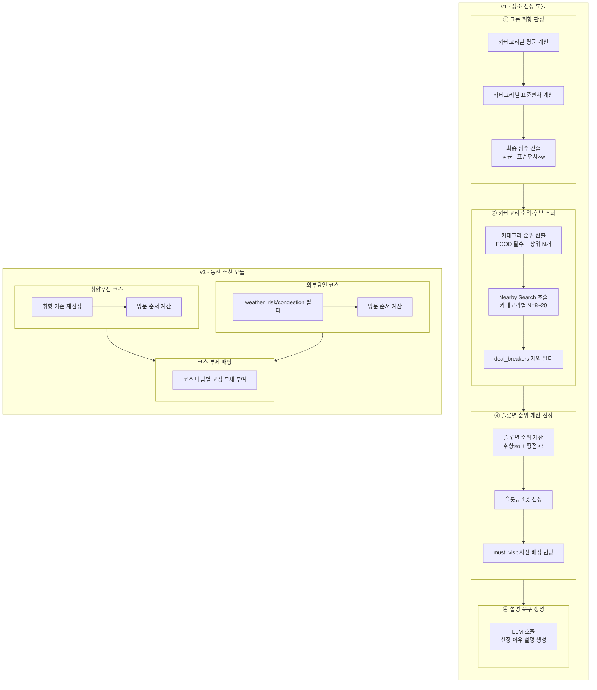

## 제출 항목

- 🚧 설계한 멀티스텝 체인/파이프라인의 다이어그램(각 단계와 역할 설명)
- 🚧 사용한 모델·도구·프레임워크 목록, 선택 이유와 기대 효과
- 🚧 구현 코드의 일부 또는 의사코드(프롬프트 구성, 모듈 호출 함수 등)
- 🚧 멀티스텝 구조 도입으로 기대되는 이점과 서비스 요구와의 관련성, 혹은 멀티스텝이 불필요하다고 판단한 이유

---

## 장소 추천 및 일정 생성

### 파이프라인 다이어그램



### 사용한 모델·도구·프레임워크

**사용한 모델·도구·프레임워크**
| 항목 | 선택 이유 | 기대 효과 |
|---|---|---|
| G방법(평균−표준편차×w) | 동점 처리를 별도 분기 없이 수식 하나로 해결 | 구현 단순성, 그룹 취향 갈림 반영 |
| Google Places API(Nearby Search) | 실재 장소 데이터 확보, type 기반 카테고리 필터링 | 결정론적 후보 확보 |
| Gemini 3.1 Pro API | v1 API 방식, 설명 문구 생성 전담 | 선정 이유를 자연스러운 문장으로 표현 |

_(TourAPI, RAG 세부 근거는 5단계 / 예산·GPU·캐싱 정책은 6단계 참고)_

### 구현 코드/의사코드

**입출력 스키마 (Pydantic)**

```python
from enum import Enum
from pydantic import BaseModel, Field


class E_Response_Status_Code(int, Enum):
    OK = 200
    INVALID_INPUT = 422
    SERVER_ERROR = 500


class E_Region(str, Enum):
    SEOUL = "서울"
    INCHEON = "인천"
    # TODO: 프론트엔드 "여행 지역" 리스트 기준 정의 필요


class E_Breaker(str, Enum):
    NOISY_PLACE = "시끄러운_곳"
    INDOOR_ACTIVITY = "실내_활동"
    OUTDOOR_ACTIVITY = "야외_활동"
    DRINKING = "술자리"
    SEAFOOD = "해산물"


class E_Google_Place_Type(str, Enum):
    TOURIST_ATTRACTION = "tourist_attraction"
    POINT_OF_INTEREST = "point_of_interest"
    MUSEUM = "museum"
    RESTAURANT = "restaurant"
    # ... 전체 type 값


class E_Preference(str, Enum):
    HISTORY_CULTURE = "HISTORY_CULTURE"
    NATURE_HEALING = "NATURE_HEALING"
    FOOD = "FOOD"
    ACTIVITY = "ACTIVITY"
    CONVENIENCE_SHOPPING = "CONVENIENCE_SHOPPING"


class E_Course_Type(str, Enum):
    PREFERENCE = "preference"
    EXTERNAL = "external"


class Display_Name(BaseModel):
    text: str
    languageCode: str


class Location(BaseModel):
    latitude: float
    longitude: float


class Member(BaseModel):
    user_id: str


class Place(BaseModel):
    id: str
    displayName: Display_Name
    location: Location
    types: list[E_Google_Place_Type]
    rating: float
    userRatingCount: int
    editorialSummary: str | None = None
    selected_for: list[str]              # user_id만
    matched_preferences: list[E_Preference]
    description: str | None = None       # ④단계에서 LLM이 채움


class Member_Survey(BaseModel):
    user: Member
    survey_result: list[int] = Field(min_length=15, max_length=15)
    deal_breakers: list[E_Breaker]
    must_visit: list[Place]


class Region(BaseModel):
    name: E_Region
    location: Location


class Generate_Request(BaseModel):
    region: Region
    start_date: str
    end_date: str
    members: list[Member_Survey]


class Response_Data(BaseModel):
    places: list[Place]


class Generate_Response(BaseModel):
    status_code: E_Response_Status_Code
    data: Response_Data


class Course(BaseModel):
    course_type: E_Course_Type
    places: list[Place]


class Course_Recommendation_Data(BaseModel):
    courses: list[Course]


class Course_Recommendation_Response(BaseModel):
    status_code: E_Response_Status_Code
    data: Course_Recommendation_Data
```

**구현 코드/의사코드**

```
FUNCTION 장소_선정(멤버목록, 지역, 회피조건, 필수방문지):

    // ① 그룹 취향 판정
    각 카테고리에 대해:
        평균 = 멤버들의 해당 카테고리 점수 합 / 인원수
        표준편차 = 개인점수와 평균의 차이를 제곱해 평균낸 값의 제곱근
        최종점수 = 평균 - (표준편차 × w)

    // ② 후보 조회·필터링
    상위카테고리 = 최종점수 기준 정렬(미식 제외) 중 상위 N개, 미식은 항상 포함
    후보목록 = 각 카테고리의 Google 타입으로 주변 검색(N=8~20, 반경=행정구역)
    후보목록에서 회피조건에 해당하는 타입 제거

    // ③ 슬롯별 장소 선정
    각 시간 슬롯(오전, 점심, 오후, 저녁, 야간)에 대해:
        해당 슬롯에 매핑된 카테고리의 후보들 중
        순위점수 = 취향점수 가중치 + 평점 가중치 로 정렬 후 최상위 1곳 선정
    필수방문지로 지정된 장소는 해당 슬롯에 강제로 대체

    // ④ 설명 문구 생성
    선정된 장소 각각에 대해:
        설명문구 = LLM에게 장소 정보·근거자료·반영된 취향을 주고 3문장 생성 요청

    선정된 장소 목록과 설명 문구를 반환


FUNCTION 동선_추천(취향점수, 후보목록, 외부요인데이터):  // v3

    // 취향우선 코스
    취향코스_장소 = 취향점수 기준으로 후보 재선정
    취향코스_순서 = 방문 순서 계산

    // 외부요인 코스
    안전후보 = 후보목록에서 weather_risk가 true이거나 congestion_level이 high인 장소 제외
    외부요인코스_장소 = 안전후보 중 선정
    외부요인코스_순서 = 방문 순서 계산

    // 부제 매핑
    각 코스에 코스 타입(취향우선/외부요인)에 따른 고정 부제 부여

    두 코스를 반환
```

### 멀티스텝 구조 도입 근거

**결론**: 4단계 분리는 "장소 추천 = 계산→모색→선택" 정의에서 출발. 원칙은 "재현성 필요=결정론, 표현 필요=생성형". 검증 결과 LLM이 남은 지점은 ④(설명 생성) 하나뿐.

---

**1. 출발점 — "장소 추천"의 정의**

> 그룹원들의 취향을 계산하여, 점수가 높은 카테고리를 우선으로 후보 장소를 모색하여, 우선순위에 맞는 장소를 선택하는 과정

느슨한 정의로 시작했다가 "취향만 판정하면 추천이 끝나는가"를 되물어 기준·후보·선택이 각각 빠짐없이 필요함을 확인함. 서비스 요구사항을 개념 정의 단계에서부터 명확히 해, 이후 파이프라인 단계 수(최소 3단계)가 자연스럽게 도출되도록 함.

---

**2. v1 ① 그룹 취향 판정**
| 항목 | 내용 |
|---|---|
| 검토 | 7가지 방법(단순평균/백분율/평균+분산 타이브레이커/최댓값/최솟값/중앙값/표준편차 보정 가중평균) |
| 문제 | 평균만으로는 "전원 3점 합의" vs "1점·5점 갈림"이 동일 취급 → 공정성 문제 |
| 채택 | **G방법**(평균−표준편차×w) |
| 채택 근거 재검토 | 팀원 기존안(C) 대비 **정확성 우위 근거 없음** — 실질 이유는 **구현 단순성** |
| w값 | Kaggle 접근 불가 → 가상 표본으로 **w=0.5 잠정 확정** |

7가지 대안을 비교표로 정리해 의사결정 근거를 남기고, 채택 후에도 팀원 논의안 대비 우위를 재검증해 "선택은 했지만 정확성이 증명된 건 아니다"라는 리스크를 그대로 문서화함. 데이터(Kaggle) 접근이 막힌 현실적 제약 앞에서는 잠정치로 먼저 출시하고 추후 보정하는 애자일 방식을 택함.

---

**3. v1 ② 카테고리 순위·후보 조회**
| 하위 항목 | 과정 | 결과 |
|---|---|---|
| 하루 장소 수 | 벤치마킹 실패 → 서비스 제약 역산 | 시간 슬롯 5구간, **4~5곳** |
| 검색 반경 | 단일 사례 근거 → 일반화 오류 지적 | **행정구역 경계 기반**, 전환 조건 명시 |
| N값 | 제약 3가지 검증 → 전부 기각 → 실제 제약 = lost in the middle | **N=8~20** |

경쟁사 벤치마킹이 막히면 서비스 자체 제약으로 역산하는 실용적 접근으로 전환하고, 가장 단순한 방법(A)부터 적용한 뒤 한계 발생 시 정교화하는 단계적 확장 전략을 채택함. N값처럼 처음 가정한 병목(비용·속도)이 실제로는 문제가 아니었음을 직접 계산으로 검증해, 추측이 아닌 근거 기반 결정을 반복함.

---

**4. v1 ③ 슬롯별 순위 계산·선정**

```
순위점수 = 취향점수×α + 평점×β
필수 방문지는 사전 강제 배정
```

취향 하나만으로 순위를 매기면 표본 적은 곳이 우연히 1위가 되는 리스크가 있어 평점(신뢰도 지표)을 함께 반영, 서비스 안정성을 우선한 결정을 내림.

---

**5. v1 ④ 설명 문구 생성 — 유일한 LLM 지점**
| 검증 대상 | 결과 |
|---|---|
| 순위·균형·맥락·성격 차이·자유텍스트 매칭 | **전부 결정론 가능** |
| 최초 LLM 채택 근거 | 재확인 결과 **실체 없음** |
| **유일하게 결정론 불가** | 자연어 설명 창작(고정 템플릿 시 반복·딱딱함) |

이미 내린 결정("LLM 필요")도 끝까지 재검증하는 개발 원칙을 적용해, 근거 없는 채택을 뒤늦게라도 바로잡음. 결과적으로 리소스(모델 호출)를 정말 필요한 지점 하나로 최소화해 비용·복잡도를 줄임.

---

**6. v3 동선 추천 — 같은 원칙, 다른 결론**
| 구분 | v1(장소) | v3(코스) |
|---|---|---|
| 설명 대상 | 장소 개별(매번 다름) | 코스 타입(3종 고정) |
| LLM 필요성 | 필요 | **불필요**(고정 부제로 충분) |

같은 설계 원칙을 다른 모듈에 기계적으로 복제하지 않고, 그 모듈의 실제 조건(코스 3종 고정)에 맞춰 재판단해 불필요한 LLM 호출을 배제함.

---

**7. 종합 원칙**

```
재현성 필요 → 결정론
표현 필요 → 생성형
```

서비스 신뢰성(재현 가능한 판단)과 사용자 경험(자연스러운 설명)을 각각 최적 수단에 배분한 것이 이 파이프라인의 핵심 설계 철학.

---

## 포토 미션

### 파이프라인 다이어그램

_(mermaid, 각 단계와 역할 — 처리 단계 순서 그대로 시각화)_

### 사용한 모델·도구·프레임워크

사용한 모델·도구·프레임워크
| 항목 | 선택 이유 | 기대 효과 |
| --- | --- | --- |

### 구현 코드/의사코드

_(프롬프트 구성, 모듈 호출 함수 등 - 입출력 스키마 재사용)_

### 멀티스텝 도입 근거

_(왜 여러 단계로 나눴는지 — "결정론적 판정과 생성형 판단 분리" 원칙 재사용)_
