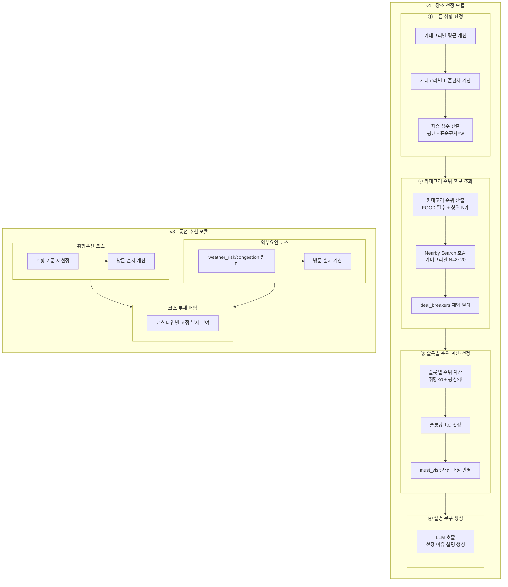
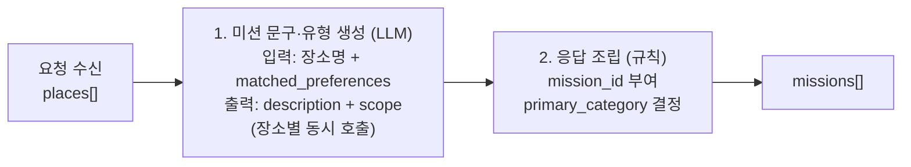
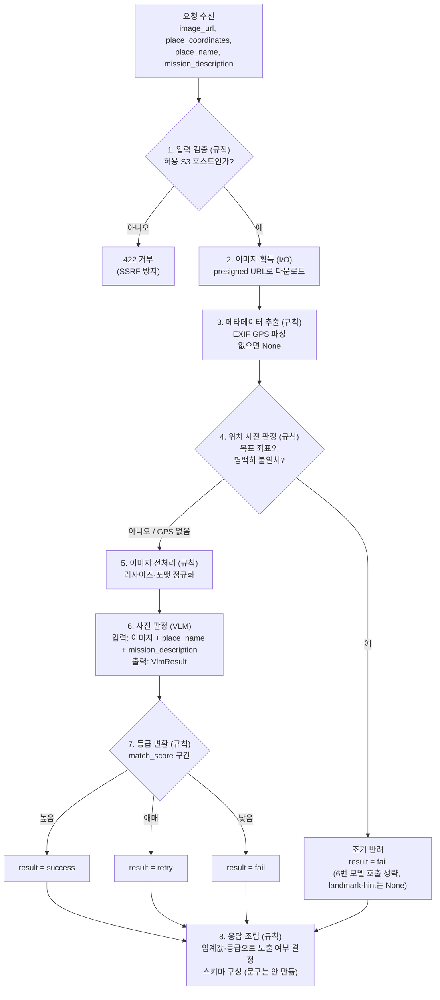

## 제출 항목

- ✅ 설계한 멀티스텝 체인/파이프라인의 다이어그램(각 단계와 역할 설명)
- ✅ 사용한 모델·도구·프레임워크 목록, 선택 이유와 기대 효과
- ✅ 구현 코드의 일부 또는 의사코드(프롬프트 구성, 모듈 호출 함수 등)
- ✅ 멀티스텝 구조 도입으로 기대되는 이점과 서비스 요구와의 관련성, 혹은 멀티스텝이 불필요하다고 판단한 이유

---

## 장소 추천 및 일정 생성

### 파이프라인 다이어그램



### 사용한 모델·도구·프레임워크

**사용한 모델·도구·프레임워크**
| 항목 | 선택 이유 | 기대 효과 |
|---|---|---|
| G방법(평균−표준편차×w) | 동점 처리를 별도 분기 없이 수식 하나로 해결 | 구현 단순성, 그룹 취향 갈림 반영 |
| Google Places API(Nearby Search) | 실재 장소 데이터 확보, type 기반 카테고리 필터링 | 결정론적 후보 확보 |
| Gemini 3.1 Pro API | v1 API 방식, 설명 문구 생성 전담 | 선정 이유를 자연스러운 문장으로 표현 |

_(TourAPI, RAG 세부 근거는 5단계 / 예산·GPU·캐싱 정책은 6단계 참고)_

### 구현 코드/의사코드

**입출력 스키마 (Pydantic)**

```python
from enum import Enum
from pydantic import BaseModel, Field


class E_Response_Status_Code(int, Enum):
    OK = 200
    INVALID_INPUT = 422
    SERVER_ERROR = 500


class E_Region(str, Enum):
    SEOUL = "서울"
    INCHEON = "인천"
    # TODO: 프론트엔드 "여행 지역" 리스트 기준 정의 필요


class E_Breaker(str, Enum):
    NOISY_PLACE = "시끄러운_곳"
    INDOOR_ACTIVITY = "실내_활동"
    OUTDOOR_ACTIVITY = "야외_활동"
    DRINKING = "술자리"
    SEAFOOD = "해산물"


class E_Google_Place_Type(str, Enum):
    TOURIST_ATTRACTION = "tourist_attraction"
    POINT_OF_INTEREST = "point_of_interest"
    MUSEUM = "museum"
    RESTAURANT = "restaurant"
    # ... 전체 type 값


class E_Preference(str, Enum):
    HISTORY_CULTURE = "HISTORY_CULTURE"
    NATURE_HEALING = "NATURE_HEALING"
    FOOD = "FOOD"
    ACTIVITY = "ACTIVITY"
    CONVENIENCE_SHOPPING = "CONVENIENCE_SHOPPING"


class E_Course_Type(str, Enum):
    PREFERENCE = "preference"
    EXTERNAL = "external"


class Display_Name(BaseModel):
    text: str
    languageCode: str


class Location(BaseModel):
    latitude: float
    longitude: float


class Member(BaseModel):
    user_id: str


class Place(BaseModel):
    id: str
    displayName: Display_Name
    location: Location
    types: list[E_Google_Place_Type]
    rating: float
    userRatingCount: int
    editorialSummary: str | None = None
    selected_for: list[str]              # user_id만
    matched_preferences: list[E_Preference]
    description: str | None = None       # ④단계에서 LLM이 채움


class Member_Survey(BaseModel):
    user: Member
    survey_result: list[int] = Field(min_length=15, max_length=15)
    deal_breakers: list[E_Breaker]
    must_visit: list[Place]


class Region(BaseModel):
    name: E_Region
    location: Location


class Generate_Request(BaseModel):
    region: Region
    start_date: str
    end_date: str
    members: list[Member_Survey]


class Response_Data(BaseModel):
    places: list[Place]


class Generate_Response(BaseModel):
    status_code: E_Response_Status_Code
    data: Response_Data


class Course(BaseModel):
    course_type: E_Course_Type
    places: list[Place]


class Course_Recommendation_Data(BaseModel):
    courses: list[Course]


class Course_Recommendation_Response(BaseModel):
    status_code: E_Response_Status_Code
    data: Course_Recommendation_Data
```

**구현 코드/의사코드**

```
FUNCTION 장소_선정(멤버목록, 지역, 회피조건, 필수방문지):

    // ① 그룹 취향 판정
    각 카테고리에 대해:
        평균 = 멤버들의 해당 카테고리 점수 합 / 인원수
        표준편차 = 개인점수와 평균의 차이를 제곱해 평균낸 값의 제곱근
        최종점수 = 평균 - (표준편차 × w)

    // ② 후보 조회·필터링
    상위카테고리 = 최종점수 기준 정렬(미식 제외) 중 상위 N개, 미식은 항상 포함
    후보목록 = 각 카테고리의 Google 타입으로 주변 검색(N=8~20, 반경=행정구역)
    후보목록에서 회피조건에 해당하는 타입 제거

    // ③ 슬롯별 장소 선정
    각 시간 슬롯(오전, 점심, 오후, 저녁, 야간)에 대해:
        해당 슬롯에 매핑된 카테고리의 후보들 중
        순위점수 = 취향점수 가중치 + 평점 가중치 로 정렬 후 최상위 1곳 선정
    필수방문지로 지정된 장소는 해당 슬롯에 강제로 대체

    // ④ 설명 문구 생성
    선정된 장소 각각에 대해:
        설명문구 = LLM에게 장소 정보·근거자료·반영된 취향을 주고 3문장 생성 요청

    선정된 장소 목록과 설명 문구를 반환


FUNCTION 동선_추천(취향점수, 후보목록, 외부요인데이터):  // v3

    // 취향우선 코스
    취향코스_장소 = 취향점수 기준으로 후보 재선정
    취향코스_순서 = 방문 순서 계산

    // 외부요인 코스
    안전후보 = 후보목록에서 weather_risk가 true이거나 congestion_level이 high인 장소 제외
    외부요인코스_장소 = 안전후보 중 선정
    외부요인코스_순서 = 방문 순서 계산

    // 부제 매핑
    각 코스에 코스 타입(취향우선/외부요인)에 따른 고정 부제 부여

    두 코스를 반환
```

### 멀티스텝 구조 도입 근거

**결론**: 4단계 분리는 "장소 추천 = 계산→모색→선택" 정의에서 출발. 원칙은 "재현성 필요=결정론, 표현 필요=생성형". 검증 결과 LLM이 남은 지점은 ④(설명 생성) 하나뿐.

---

**1. 출발점 — "장소 추천"의 정의**

> 그룹원들의 취향을 계산하여, 점수가 높은 카테고리를 우선으로 후보 장소를 모색하여, 우선순위에 맞는 장소를 선택하는 과정

느슨한 정의로 시작했다가 "취향만 판정하면 추천이 끝나는가"를 되물어 기준·후보·선택이 각각 빠짐없이 필요함을 확인함. 서비스 요구사항을 개념 정의 단계에서부터 명확히 해, 이후 파이프라인 단계 수(최소 3단계)가 자연스럽게 도출되도록 함.

---

**2. v1 ① 그룹 취향 판정**
| 항목 | 내용 |
|---|---|
| 검토 | 7가지 방법(단순평균/백분율/평균+분산 타이브레이커/최댓값/최솟값/중앙값/표준편차 보정 가중평균) |
| 문제 | 평균만으로는 "전원 3점 합의" vs "1점·5점 갈림"이 동일 취급 → 공정성 문제 |
| 채택 | **G방법**(평균−표준편차×w) |
| 채택 근거 재검토 | 팀원 기존안(C) 대비 **정확성 우위 근거 없음** — 실질 이유는 **구현 단순성** |
| w값 | Kaggle 접근 불가 → 가상 표본으로 **w=0.5 잠정 확정** |

7가지 대안을 비교표로 정리해 의사결정 근거를 남기고, 채택 후에도 팀원 논의안 대비 우위를 재검증해 "선택은 했지만 정확성이 증명된 건 아니다"라는 리스크를 그대로 문서화함. 데이터(Kaggle) 접근이 막힌 현실적 제약 앞에서는 잠정치로 먼저 출시하고 추후 보정하는 애자일 방식을 택함.

---

**3. v1 ② 카테고리 순위·후보 조회**
| 하위 항목 | 과정 | 결과 |
|---|---|---|
| 하루 장소 수 | 벤치마킹 실패 → 서비스 제약 역산 | 시간 슬롯 5구간, **4~5곳** |
| 검색 반경 | 단일 사례 근거 → 일반화 오류 지적 | **행정구역 경계 기반**, 전환 조건 명시 |
| N값 | 제약 3가지 검증 → 전부 기각 → 실제 제약 = lost in the middle | **N=8~20** |

경쟁사 벤치마킹이 막히면 서비스 자체 제약으로 역산하는 실용적 접근으로 전환하고, 가장 단순한 방법(A)부터 적용한 뒤 한계 발생 시 정교화하는 단계적 확장 전략을 채택함. N값처럼 처음 가정한 병목(비용·속도)이 실제로는 문제가 아니었음을 직접 계산으로 검증해, 추측이 아닌 근거 기반 결정을 반복함.

---

**4. v1 ③ 슬롯별 순위 계산·선정**

```
순위점수 = 취향점수×α + 평점×β
필수 방문지는 사전 강제 배정
```

취향 하나만으로 순위를 매기면 표본 적은 곳이 우연히 1위가 되는 리스크가 있어 평점(신뢰도 지표)을 함께 반영, 서비스 안정성을 우선한 결정을 내림.

---

**5. v1 ④ 설명 문구 생성 — 유일한 LLM 지점**
| 검증 대상 | 결과 |
|---|---|
| 순위·균형·맥락·성격 차이·자유텍스트 매칭 | **전부 결정론 가능** |
| 최초 LLM 채택 근거 | 재확인 결과 **실체 없음** |
| **유일하게 결정론 불가** | 자연어 설명 창작(고정 템플릿 시 반복·딱딱함) |

이미 내린 결정("LLM 필요")도 끝까지 재검증하는 개발 원칙을 적용해, 근거 없는 채택을 뒤늦게라도 바로잡음. 결과적으로 리소스(모델 호출)를 정말 필요한 지점 하나로 최소화해 비용·복잡도를 줄임.

---

**6. v3 동선 추천 — 같은 원칙, 다른 결론**
| 구분 | v1(장소) | v3(코스) |
|---|---|---|
| 설명 대상 | 장소 개별(매번 다름) | 코스 타입(3종 고정) |
| LLM 필요성 | 필요 | **불필요**(고정 부제로 충분) |

같은 설계 원칙을 다른 모듈에 기계적으로 복제하지 않고, 그 모듈의 실제 조건(코스 3종 고정)에 맞춰 재판단해 불필요한 LLM 호출을 배제함.

---

**7. 종합 원칙**

```
재현성 필요 → 결정론
표현 필요 → 생성형
```

서비스 신뢰성(재현 가능한 판단)과 사용자 경험(자연스러운 설명)을 각각 최적 수단에 배분한 것이 이 파이프라인의 핵심 설계 철학.

---

## 포토 미션

### 파이프라인 다이어그램

**1) `photomissions/generate` — 미션 생성**



**각 단계의 책임과 인터페이스 — `generate`**
| # | 단계 | 책임 | 입력 → 출력 | 방식 | 병목 |
|---|---|---|---|---|---|
| 1 | 미션 문구·유형 생성 | **사진으로 판정 가능한** 행동을 한 문장으로 작성하고, 대표 사진 한 장으로 전원 완료되는지(`GROUP`) 각자 제출해야 하는지(`PERSONAL`)를 함께 정함 | 장소·취향 → `description`·`scope` | **LLM** | decode - 장소 수만큼 호출하므로 출력 토큰이 장소 수에 비례. 장소별 호출은 동시에 실행 |
| 2 | 응답 조립 | `mission_id` 부여, `matched_preferences[0]`로 `primary_category` 결정, 응답 스키마 구성 | 위 결과 → `Mission` | 규칙 | 없음 |

**2) `photomissions/{mission_id}/verify` — 사진 판정**

> AI 서버는 재시도 횟수나 마감 여부를 판단하지 않는다. 몇 번째 시도인지, 한도를 넘었는지는
> 백엔드가 이 요청을 보내기 전에 이미 걸러진다(백엔드 API의 `MISSION_PHOTO_RETRY_LIMIT_EXCEEDED`,
> `PHOTO_MISSION_SUBMISSION_CLOSED` 정책 참고). AI가 받는 요청은 몇 번째 시도든 항상 같은 모양이다.



**각 단계의 책임과 인터페이스 — `verify`**
| # | 단계 | 책임 | 입력 → 출력 | 방식 | 병목 |
|---|---|---|---|---|---|
| 1 | 입력 검증 | 허용된 출처에서 온 URL인지만 확인 | `image_url` → 통과 / 422 | 규칙 | 없음(호스트 비교) |
| 2 | 이미지 획득 | presigned URL로 원본 바이트 확보 | `image_url` → `bytes` | I/O | S3 다운로드 - 서버 간 통신이라 빠를 것으로 예상되나 원본 해상도가 크면 실측 필요 |
| 3 | 메타데이터 추출 | EXIF에서 GPS 좌표만 꺼냄 | `bytes` → `Coordinates \| None` | 규칙 | 없음 |
| 4 | 위치 사전 판정 | 목표 좌표와 명백히 먼지 판단 | (GPS, 목표 좌표) → 조기 반려 여부 | 규칙 | 없음(거리 계산) |
| 5 | 이미지 전처리 | 리사이즈·포맷 정규화로 입력 크기 축소 | `bytes` → `bytes` | 규칙 | 인코딩(prefill) - 2단계에서 식별한 1순위 병목 |
| 6 | 사진 판정 | 인식 라벨 → 랜드마크 인식 → 미션 점수 → 재촬영 힌트를 한 번의 호출로 산출 | (이미지, 장소명, 미션 내용) → `VlmResult` | **VLM** | decode - 출력이 짧아 `generate`보다 비중은 작을 것으로 예상 |
| 7 | 등급 변환 | 점수를 success/retry/fail로 매핑 | `match_score` → `result` | 규칙 | 없음(임계값 비교) |
| 8 | 응답 조립 | 오케스트레이터가 건넨 원값에 임계값·등급을 적용해 `landmark_confidence`·`retry_hint`의 노출 여부를 정하고 스키마를 구성 (안내 문구는 만들지 않음 — 아래 참고) | 위 결과 → `VerifyResponse` | 규칙 | 없음(임계값·조건 비교) |

**모델이 들어가는 자리는 두 곳뿐이다.** `generate`의 1번과 `verify`의 6번. 나머지 여덟 단계는 전부 규칙으로 답이 정해진다.

### 사용한 모델·도구·프레임워크

사용한 모델·도구·프레임워크
| 항목 | 선택 이유 | 기대 효과 |
| --- | --- | --- |
| FastAPI | 파이프라인이 이미지 다운로드·모델 호출 등 대기가 많은 I/O로 이뤄져 `async` 기반 프레임워크가 맞다. 1·3단계에서 정의한 Pydantic 모델을 요청·응답 스키마로 그대로 쓸 수 있다 | 문서의 스키마가 곧 실행되는 검증 코드가 되어, 스키마와 구현이 어긋날 여지가 줄어든다 |
| Gemini 3.1 Pro (v1, 문구 생성·사진 판정) | 2단계에서 채택한 모델을 포토미션에도 그대로 쓴다. `verify`는 랜드마크 인식 정확도가 판정 품질을 좌우하는데 아직 실측 전이라, v1에서는 티어를 낮추기보다 팀이 쓰는 모델 하나로 통일해 운영·측정 기준을 단순하게 가져간다 | 모델 축 변수를 없애 2단계 baseline 측정이 단순해진다. 실측 후 정확도에 여유가 확인되면 같은 구독 안에서 Flash 계열로 내려 비용을 낮출 수 있다(2단계 모델 선정 근거의 "작업별 티어링") |
| Qwen2.5-VL-7B-Instruct-AWQ (4bit, vLLM 서빙) | 2단계에서 `verify`를 로컬 전환 1순위로 지정(실시간 제약·GPU 부하가 모두 큼). 텍스트·비전을 한 모델로 처리해 서빙 구성이 단순함 | 호출당 과금에서 GPU 고정비로 전환. 단, 양자화 시 정확도 유지가 관건이라 평가셋 점수로 전환 시점을 정함 |
| Pydantic | 팀 전체가 LLM 출력 파싱과 서비스 간 계약에 사용. 1·3단계에서 정의한 입출력 스키마를 그대로 재사용 | 모델이 스키마를 벗어난 출력을 냈을 때 응답 조립 전에 걸러짐. 파싱 실패를 재시도 지표로 계측 가능 |
| Gemini SDK 직접 호출 (구조화 출력) | 모델 비교 테스트에서 형식을 강제하지 않으면 지정한 스키마를 벗어나는 경향이 관찰됨(2단계 모델 선정 근거 참고). SDK의 구조화 출력에 위 Pydantic 모델을 그대로 넘기면 되므로 별도 프레임워크가 필요 없다 | 파싱 실패로 인한 재시도를 줄여 latency·비용을 함께 절감. 추상화 계층이 없어 2단계의 TTFT/decode 스트리밍 계측을 응답에서 바로 할 수 있다 |
| Pillow (EXIF 추출·리사이즈) | EXIF 읽기와 리사이즈를 한 라이브러리로 처리할 수 있고, 3·5번 단계가 그 두 가지뿐이라 별도 이미지 서비스를 둘 이유가 없다 | 인코딩(prefill) 병목을 앞단에서 축소. 클라이언트가 원본을 보낸 경우의 2차 방어선 역할 |
| Haversine 공식 (직접 구현) | 4번 단계는 두 좌표 간 직선 거리만 필요하고, "명백한 불일치"(수십 km 차이)만 판별하면 되므로 지도 API 호출이 불필요 | 외부 API 호출 없이 오답 케이스를 걸러 6번(모델 호출)을 통째로 생략 |

**LangChain / LangGraph를 쓰지 않는 이유**

두 프레임워크가 푸는 문제(체인 연결, 상태 기반 분기·순환)가 이 파이프라인에 없다.

- **체인**: 모델 호출은 엔드포인트마다 한 번(`generate`는 장소마다 한 번)이고, 한 호출의 출력을 다른 호출의 입력으로 넘기는 일이 없어 엮을 것이 없다.
- **분기·순환**: 분기는 위치 사전 판정의 조기 반려 하나뿐이고, 순환은 없다.

두 프레임워크에서 실익이 있는 기능은 구조화 출력뿐인데, 이는 Gemini SDK가 직접 제공한다. 추상화 계층을 걷어내는 편이 2단계에서 계획한 TTFT/decode 스트리밍 계측에도 유리하다.

### 구현 코드/의사코드

입출력 스키마는 1·3단계에서 정의한 것을 그대로 쓴다. 각 단계는 **자기 판단만 하고 다음 단계의 일에는 관여하지 않는다.** 오케스트레이터는 단계를 순서대로 호출하기만 한다.

**1) 미션 생성 — 오케스트레이터**

```python
async def generate_missions(request: PhotoMissionGenerateRequest) -> PhotoMissionGenerateResponse:
    # 장소별 호출은 서로 독립적이라 동시에 보낸다
    results = await asyncio.gather(
        *(write_description(place) for place in request.places)            # 1
    )
    missions = [
        build_mission(place, result)                                        # 2
        for place, result in zip(request.places, results)
    ]
    return PhotoMissionGenerateResponse(missions=missions)
```

**단계별 함수**

```python
class MissionDescription(BaseModel):
    description: str
    scope: Literal["PERSONAL", "GROUP"]  # 한 사람 사진이 다른 사람 몫을 대신할 수 있으면 GROUP


async def write_description(place: MissionPlace) -> MissionDescription:
    """1. 미션 문구·유형 생성 — 문구와 scope를 한 번의 호출로 함께 정한다.
    mission_id는 여기서 다루지 않는다.

    이 문구는 verify 요청의 mission_description으로 다시 들어가 판정 기준이 되므로,
    사진만 보고 수행 여부를 알 수 있는 문구여야 한다.
    """
    user_prompt = (
        f"장소명: {place.displayName.text}\n"
        f"반영된 취향: {', '.join(place.matched_preferences) or '없음'}"
    )
    return await generate_structured(
        system=MISSION_SYSTEM_PROMPT,
        user=user_prompt,
        response_schema=MissionDescription,   # Pydantic 모델을 그대로 넘긴다
    )


def pick_primary_category(matched_preferences: list[T_Preference]) -> T_Preference | None:
    """대표 카테고리를 정한다. 규칙만 적용한다 — 모델을 호출하지 않는다.
    여러 개면 첫 번째, 없으면 None. 프론트엔드가 verify 응답의 안내 문구를
    조립할 때 이 값으로 카테고리를 판단한다."""
    return matched_preferences[0] if matched_preferences else None


def build_mission(place: MissionPlace, result: MissionDescription) -> Mission:
    """2. 응답 조립 — mission_id를 부여하고 스키마를 구성한다."""
    return Mission(
        mission_id=new_mission_id(),
        place_id=place.id,
        description=result.description,
        scope=result.scope,
        primary_category=pick_primary_category(place.matched_preferences),
    )
```

Gemini 호출 에러는 HTTP 상태 코드로 바꿔 돌려준다(429 → 429 + `Retry-After`, 그 외 → 502, 타임아웃 → 504). `verify`의 6번도 같다.

**1번 단계 프롬프트**

```python
MISSION_SYSTEM_PROMPT = """\
너는 그룹 여행의 사진 미션을 만드는 AI다.
주어진 장소와 그 장소가 선택된 이유(matched_preferences)를 바탕으로,
여행자가 그 장소에서 찍을 사진 미션 문구(description)와 완료 방식(scope)을 함께 정한다.

[미션이 갖춰야 할 것]
1. 사진 한 장만 보고 수행 여부를 판단할 수 있어야 한다.
   이 문구는 나중에 제출된 사진과 함께 판정 모델에 전달되기 때문이다.
   - 좋음: 오래된 기와지붕이 화면에 크게 담기도록 찍기
   - 나쁨: 이곳의 분위기 느껴보기 / 현지인과 대화 나누기
2. 무엇을 찍어야 하는지가 문장에 드러나야 한다.
   장소 이름만 반복하지 말고, 그 장소에서 담을 대상을 지정한다.
   - 좋음: 대릉원의 능선이 이어지는 모습 담기
   - 나쁨: 대릉원에서 사진 찍기

[쓰지 않는 것]
3. 왜 이 미션이 만들어졌는지는 쓰지 않는다. 수행할 행동만 적는다.
   - 나쁨: 역사·유적 취향을 살려 기와지붕 담기
4. 사람 이름과 인원수를 넣지 않는다. 참여 인원은 실제와 다를 수 있다.
5. 특정 시간대나 날씨를 전제하지 않는다. 방문 시각과 날씨를 알 수 없기 때문이다.
   - 나쁨: 해질녘 / 야경 / 눈 내리는 날 / 비 오는 날

[소재 선택]
6. matched_preferences로 담을 대상의 종류를 정한다. 취향 이름 자체는 문구에 쓰지 않는다.
   HISTORY_CULTURE      -> 건축물·유적·전통 요소
   NATURE_HEALING       -> 풍경·자연물
   FOOD                 -> 음식·먹거리
   ACTIVITY             -> 체험·활동 장면
   CONVENIENCE_SHOPPING -> 상점·물건
   비어 있으면 그 장소의 대표적인 볼거리를 대상으로 삼는다.
  여러 개가 오면 첫 번째를 주 소재로 삼고, 나머지는 무시한다.
  둘을 한 문구에 억지로 담지 않는다.
[scope 판정]
7. scope는 "대표 사진 한 장으로 전원 완료 처리되는지(GROUP)" 아니면
   "각자 자기 사진을 따로 제출해야 완료되는지(PERSONAL)"를 나타낸다.
   판단 기준은 하나뿐이다 — 한 사람이 낸 사진이 다른 사람 몫을 대신할 수 있는가.
   - 대신할 수 있으면 GROUP (예: 건물·풍경처럼 누가 찍어도 같은 대상)
   - 대신할 수 없으면 PERSONAL (예: "각자 인상적인 디테일 하나씩"처럼 사람마다 답이 달라야 함)
8. "다 같이"/"각자" 같은 인원 표현은 scope와 별개로, 미션 내용상 자연스러울 때만 쓴다.
   - 사람이 등장하는 미션(단체샷, 포즈)이면 "다 같이"가 자연스럽다
   - 구도·사물 중심 미션(기와지붕, 풍경)이면 인원 표현 없이 그대로 쓴다
   - scope가 GROUP이라고 해서 문구에 "다 같이"를 억지로 넣지 않는다

[어투]
- 한국어로 쓰고, 문구는 명사형으로 끝낸다. (예: 기와지붕 담기, 골목 사진 찍기)
- 딱딱한 지시문("촬영할 것")이 아니라, 여행 중에 보고 바로 하고 싶어지는 어감으로 쓴다.
"""
```

**2) 사진 판정 — 오케스트레이터**

```python
async def verify_photo(request: VerifyRequest) -> VerifyResponse:
    assert_allowed_source(request.image_url)                                    # 1
    image_bytes = await fetch_image(request.image_url)                          # 2
    exif_gps = extract_gps(image_bytes)                                         # 3

    if is_clear_mismatch(exif_gps, request.place_coordinates):                  # 4
        # 5~7번을 건너뛴다. 모델 호출 없이 끝나는 유일한 경로.
        return build_response("fail", match_score=0.0, reason="location_mismatch")

    processed = normalize_image(image_bytes)                                    # 5
    vlm = await score_photo(                                                    # 6
        processed, request.place_name, request.mission_description
    )
    result = to_grade(vlm.match_score)                                          # 7

    # 오케스트레이터는 판단하지 않는다. VLM 원값을 그대로 8번에 넘긴다.
    return build_response(                                                      # 8
        result, vlm.match_score, vlm.detected_labels,
        raw_landmark_confidence=vlm.landmark_confidence,
        raw_retry_hint=vlm.retry_hint,
    )
```

**단계별 함수 — 규칙**

```python
def assert_allowed_source(image_url: str) -> None:
    """1. 입력 검증 — 허용 목록에 등록한 S3 버킷 호스트인지만 본다."""
    if urlparse(image_url).hostname not in settings.allowed_image_hosts_list:
        raise HTTPException(422, "허용되지 않은 이미지 호스트입니다")


def extract_gps(image_bytes: bytes) -> Coordinates | None:
    """3. 메타데이터 추출 — 좌표를 꺼내기만 한다. 멀고 가까움은 판단하지 않는다."""
    ...  # Pillow / exifread


def is_clear_mismatch(gps: Coordinates | None, target: Coordinates) -> bool:
    """4. 위치 사전 판정 — GPS가 없으면 판단하지 않는다(False를 돌려 6번으로 넘긴다)."""
    if gps is None:
        return False
    return haversine_km(gps, target) > CLEAR_MISMATCH_KM


def to_grade(match_score: float) -> Literal["success", "retry", "fail"]:
    """7. 등급 변환 — 임계값 규칙만. 모델을 호출하지 않는다."""
    if match_score >= SUCCESS_THRESHOLD:
        return "success"
    if match_score >= RETRY_THRESHOLD:
        return "retry"
    return "fail"


# 안내 문구는 여기서 만들지 않는다. AI는 미션의 카테고리(유적/음식/활동 등)를 모른다 —
# verify 요청에 matched_preferences가 없기 때문이다. 문구는 result·reason과,
# photomissions/generate 응답의 Mission.primary_category를 프론트엔드가 조합해 만든다.


def build_response(
    result, match_score, detected_labels=None,
    raw_landmark_confidence=None, raw_retry_hint=None, reason=None,
) -> VerifyResponse:
    """8. 응답 조립 — landmark_confidence·retry_hint의 노출 여부를 임계값·등급으로 정하고
    스키마를 구성한다. 문구는 붙이지 않는다."""
    # 랜드마크 노출 여부는 등급이 아니라 인식 신뢰도로 결정된다.
    # 미션은 못 채웠어도(retry) 그것이 목표 장소임을 알아봤다면 카드를 띄운다.
    landmark_confidence = (
        raw_landmark_confidence
        if raw_landmark_confidence is not None
        and raw_landmark_confidence >= LANDMARK_THRESHOLD
        else None
    )
    # 힌트는 항상 생성되지만, 다시 찍으라고 안내하는 retry에서만 노출한다.
    retry_hint = raw_retry_hint if result == "retry" else None

    return VerifyResponse(
        result=result,
        reason=reason,
        match_score=match_score,
        detected_labels=detected_labels or [],
        landmark_confidence=landmark_confidence,
        retry_hint=retry_hint,
    )
```

**단계별 함수 — 모델**

```python
class DetectedLabel(BaseModel):
    name: str      # 사진에서 알아본 것 (일반명사)
    matched: bool  # 미션 조건과 관계있는지 — 화면에서 강조 표시에 쓰인다


class VlmResult(BaseModel):
    """필드 순서가 곧 생성 순서다. 관찰 → 인식 → 판단 → 조언 차례로 두어,
    점수를 먼저 정하고 라벨로 정당화하는 흐름을 막는다."""
    detected_labels: list[DetectedLabel]  # 관찰 — 사진에 무엇이 보이는가
    landmark_confidence: float            # 인식 — 그것이 목표 장소인가 (0~100)
    match_score: float                    # 판단 — 미션대로 찍혔는가 (0~100)
    retry_hint: str                       # 조언 — 항상 생성. 노출 여부는 8번이 정한다


async def score_photo(image: bytes, place_name: str, mission_description: str) -> VlmResult:
    """6. 사진 판정 (VLM) — 점수·라벨·랜드마크 인식 여부·힌트를 한 번에 낸다.
    등급(success/retry/fail)은 7번이 정한다."""
    user_prompt = f"목표 장소: {place_name}\n미션 내용: {mission_description}"
    image_part = types.Part.from_bytes(data=image, mime_type="image/jpeg")
    return await generate_structured(
        system=VERIFY_SYSTEM_PROMPT,
        user=[user_prompt, image_part],       # 텍스트 + 이미지
        response_schema=VlmResult,
    )

```

**6번 단계 프롬프트**

```python
VERIFY_SYSTEM_PROMPT = """\
너는 여행 포토미션 인증 사진을 판정하는 AI다.
주어진 사진과 목표 장소·미션 내용을 보고 아래 네 가지를 순서대로 판단하라.
앞의 판단이 뒤의 판단을 위한 근거가 되므로, 순서를 지켜서 답한다.

[1. detected_labels]
사진에서 알아본 것을 3~4개의 짧은 명사로 나열하고,
각각이 미션 조건과 관계있는지를 matched로 표시한다.
- 미션이 "유적지 전경 담기"이고 사진에 유적·고분·잔디·하늘이 보인다면
  유적·고분은 matched=true, 잔디·하늘은 matched=false다.
- 고유명사가 아니라 일반적인 사물·풍경 이름으로 쓴다.  (X) 첨성대   (O) 유적
- 사진에 실제로 보이는 것만 쓴다.
  미션 내용에 나온다고 해서 사진에도 있다고 가정하지 않는다.
- 미션과 관계있는 것이 하나도 안 보이면 matched=true인 라벨이 없어도 된다.
  억지로 하나를 맞추지 않는다.

[2. landmark_confidence]
사진 속에 목표 장소 자체가 얼마나 알아볼 수 있게 담겼는지를 0~100으로 답한다.
- match_score와 별개다. 유적이 작게 나와 미션은 못 채웠더라도,
  그것이 목표 장소임을 알아볼 수 있으면 높은 값을 준다.
- "찾았다/못 찾았다"는 판정하지 않는다. 점수만 낸다.

[3. match_score]
위에서 본 것을 근거로, 사진이 미션 내용대로 찍혔는지를 0~100 점수로 매긴다.
- 목표 장소에서 찍혔는지도 함께 보되 비중은 낮게 둔다.
  위치는 앞 단계에서 GPS로 이미 걸렀고, 장소 인식은 landmark_confidence가 따로 잰다.
- 장소는 맞지만 미션과 무관한 사진이면 낮은 값을 준다. 미션을 하지 않은 것이다.
- 사진 자체를 판정할 수 없으면(스크린샷, 심한 흔들림, 지나치게 어두움) 낮은 값을 준다.
  이 경우는 '확신 없음'이 아니라 명확한 불일치다.
- 그 외에 확신이 없으면 임의로 높은 점수를 주지 말고 중간값을 준다.
  애매한 구간은 서버가 '재시도'로 처리하므로, 억지 판정보다 낫다.
- 등급(success/retry/fail)은 판정하지 않는다. 점수만 낸다.

[4. retry_hint]
점수와 무관하게, 이 사진을 다시 찍는다면 무엇을 바꾸면 좋을지 한 문장으로 적는다.
언제 사용자에게 보여줄지는 서버가 정하므로, 여기서는 항상 생성한다.
- 사진에서 실제로 관찰한 문제를 근거로 쓴다.
  (O) 건물이 화면에서 작게 나왔어요. 한 발 물러나서 다시 찍어보세요.
  (X) 예쁘게 다시 찍어보세요.
- TODO: 글자 수 상한 미정. 화면상 2줄로 보이나 정확한 상한은 프론트 확인 후 추가한다.
"""
```

`SUCCESS_THRESHOLD` / `RETRY_THRESHOLD` / `LANDMARK_THRESHOLD` / `CLEAR_MISMATCH_KM`은 실측 전이므로 값을 정하지 않고, 2단계 평가셋으로 확정한다.

### 멀티스텝 도입 근거

**원칙 1: 한 단계는 한 가지만 판단한다.**

3번(EXIF 추출)과 4번(위치 판정)은 한 덩어리로 묶을 수도 있었지만 나눴다. 3번은 "좌표가 있는가"를, 4번은 "그 좌표가 먼가"를 답한다. 실패하는 방식이 다르고(EXIF 없음 vs 거리 초과), 2단계에서 **"EXIF 없음 비율"과 "조기 반려 비율"을 따로 측정**하기로 했으므로 계측 단위와도 맞는다.

7번(등급 변환)과 8번(응답 조립)도 같은 이유로 나눴다. 7번은 점수를 등급으로 바꾸는 판정이고, 8번은 VLM 원값에 임계값·등급을 적용해 랜드마크·retry_hint의 노출 여부를 정하고 응답 스키마를 구성하는 조립이다. 안내 문구는 8번도 만들지 않는다 — AI는 미션의 카테고리(유적/음식/활동 등)를 모른다. `verify` 요청에 `matched_preferences`가 없기 때문이다. 대신 `result`·`reason`과 `generate` 응답의 `Mission.primary_category`를 프론트엔드가 조합해 문구를 만든다. AI가 만드는 값은 등급·사유뿐이고, 문장으로 옮기는 일은 그 값을 소비하는 쪽이 한다.

**원칙 2: 규칙으로 답이 정해지는 판단은 모델에 맡기지 않는다.**
| 판단 | 답을 정하는 방법 | 모델에 맡기면 |
|---|---|---|
| GPS 명백 불일치 | 좌표 간 거리 계산 | 답이 확정적인 케이스에 비싼 VLM을 호출하게 됨 |
| success/retry/fail 등급 | `match_score` 임계값 비교 | 임계값을 조정할 때마다 프롬프트를 고쳐야 하고, 같은 점수에 다른 등급이 나올 수 있음 |
| 랜드마크 인식 여부 | `landmark_confidence` 임계값 비교 | `match_score`와 같은 이유. 모델이 "찾았다/못 찾았다"를 직접 정하면 기준을 조정할 때마다 프롬프트를 고쳐야 함 |
| 대표 카테고리(`primary_category`) | `matched_preferences[0]` | 모델이 소재를 정하는 것과, 카테고리를 구조화된 값으로 정확히 돌려주는 것은 다른 일이다. 후자를 모델에 맡기면 오타·표기 흔들림이 생길 수 있음 |

**이렇게 나눠서 얻는 것**

- **비용·latency 절감**: 4번에서 명백한 오답을 걸러내면 6번(유일한 모델 호출)이 통째로 사라진다. 이미지 인코딩 때문에 VLM은 텍스트 호출보다 비싸므로 앞단에서 거르는 이득이 크다.
- **재현성과 테스트 용이성**: 규칙 단계는 모델 없이 단위 테스트가 가능하다. `pick_primary_category`, `is_clear_mismatch`, `to_grade`, `build_response`는 입력만 주면 항상 같은 답이 나오므로, 모델 응답을 모킹하지 않고도 검증할 수 있다.
- **임계값 조정이 프롬프트와 분리됨**: 2단계 평가셋으로 임계값을 확정할 때 7번 함수만 바꾸면 되고 6번 프롬프트는 건드리지 않는다. VLM은 점수만 내고 등급은 코드가 정하기 때문이다.
- **교체 범위가 한 단계로 한정됨**: v1 프론티어 API에서 v3 자체 서빙(Qwen2.5-VL)으로 바꿔도 교체 대상은 6번뿐이고, 저장소를 S3에서 다른 것으로 바꿔도 2번뿐이다 — 3단계 "모델 교체 시 영향 범위" 사례와 같은 이유다.

**서비스 요구와의 관련성**

`verify`는 사용자가 여행 중 화면을 손에 쥔 채 결과를 기다리는 엔드포인트다. 대기가 길어지면 결과를 확인하지 않고 다음 장소로 이동해버리는 이탈로 이어지므로, 2단계에서 비동기 처리를 기각하고 동기 응답을 유지하기로 했다. 4번 조기 반려는 그 제약 안에서 일부 요청을 모델 호출 없이 더 빨리 끝내는 장치다.

`retry` 등급을 따로 둔 것도 서비스 요구에서 나왔다. 성공/실패 이분법이면 애매한 점수의 사진이 사용자에게 설명 없이 실패로만 보인다. 7번에서 세 등급으로 나누고 8번에서 `retry`일 때만 `retry_hint`를 내려주기 때문에, 프론트엔드가 "다시 찍어보세요"라는 안내와 구체적인 재촬영 힌트를 보여줄 수 있다.
