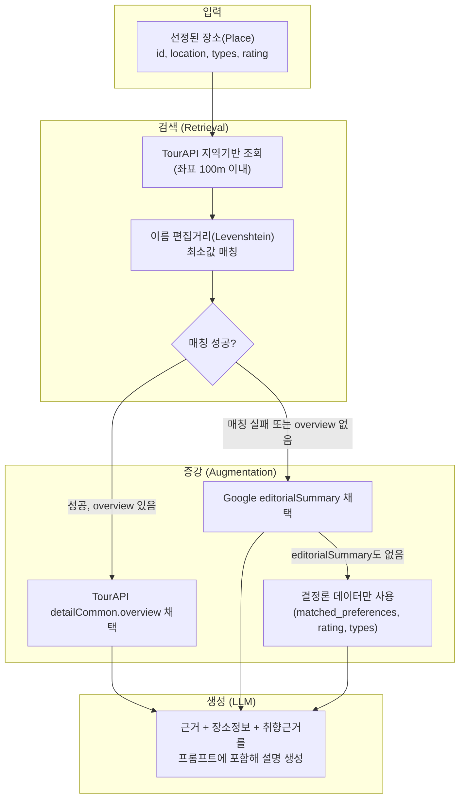

## 제출 항목

- 🚧 전체 데이터 흐름도(입력 -> 검색 -> 증강 -> 모델 응답/생성 결과)
- 🚧 사용 데이터/지식 소스 설명과 선택 이유(예: 이미지/영상 DB, 음성 데이터베이스, 텍스트 문서 등)
- 🚧 검색·임베딩·인덱싱 구현 내용과 모델 통합 방법(프롬프트 또는 입력 포맷)
- 🚧 컨텍스트 보강 도입 전후 예상 효과와 검증 계획, 혹은 도입이 불필요한 경우 그 이유

---

## 장소 추천 및 일정 생성

## 단계 5-1: 장소 추천 컨텍스트 보강 (RAG)

### 데이터 흐름도



### 사용 데이터·지식 소스와 선택 이유

**사용 데이터·지식 소스와 선택 이유**
| 소스 | 우선순위 | 선택 이유 |
|---|---|---|
| TourAPI(detailCommon.overview) | 1순위 | 한국관광공사 공공데이터, 국내 관광지 특화, 저작권 부담 낮음 |
| Google Places editorialSummary | 2순위 | Google 자체 편집 콘텐츠, 개인 저작권 문제 없음. 다만 일부 장소만 존재 |
| 결정론 데이터(matched_preferences, rating, types) | 3순위(폴백) | 근거 자료가 전혀 없을 때의 최소 안전판 |
| 리뷰(reviews) | **제외** | 제3자(개인) 저작물, attribution 요건(작성자·원본링크 표시)과 캐싱 제한이 커 채택 안 함 |

### 검색·매칭 구현 방식

**검색·매칭 구현**
| 항목 | 내용 |
|---|---|
| 검색 방식 | 임베딩 기반 유사도 검색이 아닌, **좌표 거리 + 문자열 편집거리**로 매칭 |
| 이유 | Google `place_id`와 TourAPI `contentId`가 서로 다른 체계라 벡터 검색보다 결정론적 매칭이 더 정확하고 구현이 단순함 |
| 매칭 규칙 | 좌표 100m 이내 후보만 추림 → 그중 이름 편집거리 최소값 채택 → 임계치(이름 길이 50%) 초과 시 매칭 실패로 간주 |

**1. 모델 통합 방법**

- LLM 프롬프트에 근거 자료를 "공식 설명" 필드로 명시적으로 주입
- 근거 없을 때는 "없음"으로 명시해 LLM이 추측하지 않도록 지시
- 표4-1의 ④단계(설명 문구 생성)와 동일한 호출 지점에서 통합 실행(별도 API 호출 아님)

**2. 도입 전후 예상 효과와 검증 계획**
| 항목 | 수치 |
|---|---|
| RAG 미적용(프롬프트 지시만) | 할루시네이션 최대 15% 감소 |
| RAG 적용 | 할루시네이션 75~90% 감소 |
| Gemini 3.1 Pro 실측 할루시네이션(팩트 질의) | 약 10.4% — RAG 미적용 시 유의미한 위험 |
| Gemini 3.1 Pro "모델이 답을 모를 때" 지어내는 비율 | 약 50% |

**검증 계획**: 동일 장소 세트에 대해 RAG 적용/미적용 설명 문구를 생성한 뒤, 사실관계 오류 여부를 표본 검수(무작위 N개 장소, 팀원 수동 검토)로 비교 — 실측 데이터는 표164(단계 2 프로파일링)와 같은 방식으로 이후 채워 넣을 예정.

---

### 컨텍스트 보강 도입 근거

**결론**: 리뷰 대신 TourAPI를 RAG 근거로 채택. "API 제공=재사용 허가"라는 오해를 걷어내고, 실측 할루시네이션 수치(10.4%)를 근거로 도입 필요성을 확정.

---

**1. 출발점 — "AI가 아는 대로 설명해도 되는가"**

| 검토                            | 결과                                                       |
| ------------------------------- | ---------------------------------------------------------- |
| "구글 API 제공 = 사용 허가"     | **오류** — 조회 가능과 저장·재사용 가능은 별개             |
| "LLM 가공하면 저작권 문제 없다" | **오류** — 원문을 프롬프트 입력에 쓰는 것 자체가 이용 행위 |

사용자에게 신뢰를 주는 서비스가 되려면 정확성이 곧 제품 품질이라는 관점에서, 편의상의 가정("아마 괜찮을 것")을 걷어내고 공식 정책 문서를 직접 확인하는 절차를 개발 원칙으로 삼음.

---

**2. Google Places 정책 원문 확인**

| 확인 사항      | 내용                                        |
| -------------- | ------------------------------------------- |
| 캐싱 허용 필드 | `place_id`뿐, 그 외 전부 금지(예외 없음)    |
| 리뷰 표시 요건 | 작성자 출처, 원본 링크, 정렬 기준 고지 필수 |

이 확인 과정에서 기존에 세워뒀던 장소 캐싱 정책(24시간 TTL)도 실제로는 정책 위반 소지가 있다는 게 함께 드러나, 별도 팀 논의 안건으로 보류함 — 개발 진행 중 발견된 리스크를 숨기지 않고 즉시 백로그로 등록하는 방식.

---

**3. 리뷰 대안 소스 탐색 → TourAPI 채택**

| 후보                     | 채택 여부                                                     |
| ------------------------ | ------------------------------------------------------------- |
| Google editorialSummary  | 보조 채택(일부 장소만 존재)                                   |
| **한국관광공사 TourAPI** | **주 채택** — 국내 관광지 특화, 공공데이터라 저작권 부담 적음 |
| 위키백과                 | 미채택 — 로컬 맛집 등 커버리지 부족                           |

이미 서비스 초기 지도 API 후보 검토 단계에서 스쳐 지나갔던 TourAPI를, 이번 문제(신뢰할 수 있는 배경 정보 소스 필요)에 다시 꺼내 씀 — 이전 검토 자료를 폐기하지 않고 재활용하는 것도 효율적인 개발 관행.

---

**4. 할루시네이션 리스크의 정량화**

| 수치                      | 의미                                                 |
| ------------------------- | ---------------------------------------------------- |
| 프롬프트만: 최대 15% 감소 | 지시문만으로는 한계가 뚜렷                           |
| RAG 적용: 75~90% 감소     | 근거 제공이 압도적으로 효과적                        |
| Gemini 3.1 Pro 실측 10.4% | "무시할 수준"이라는 막연한 기대가 근거 없었음을 확인 |

"위험해도 괜찮다, 다른 방법으로 보완하겠다"는 의사결정을 내리되, 그 위험의 크기를 숫자로 먼저 확인한 뒤 감수하는 방식 — 리스크를 인지하지 못한 채 진행하는 것과, 크기를 알고 수용하는 것은 다른 결정임을 문서에 남김.

---

**5. ID 체계 불일치 문제와 해결**

| 문제 | Google `place_id` ≠ TourAPI `contentId` |
| ---- | --------------------------------------- |
| 해결 | 좌표 100m + 편집거리 최소값 매칭        |

서로 다른 두 외부 시스템을 연결할 때 흔히 생기는 통합 문제를 미리 예상하지 못했다가, 실제 설계 중 뒤늦게 발견함. 벡터 임베딩 같은 복잡한 방법 대신, 데이터 특성(짧은 한글 고유명사, 좌표 존재)에 맞는 가장 단순한 결정론적 규칙을 택함.

---

**6. 종합 원칙**

```
근거 있으면 근거 기반 생성
근거 없으면 최소 정보로만 생성 (추측 금지)
```

정확성이 검증되지 않은 기능은 "사용 금지"가 아니라 "위험을 줄이는 장치와 함께 도입"하는 게 실용적인 개발 판단이라는 관점을 일관되게 적용함.

## 포토 미션

### 전체 데이터 흐름도

_(입력 → 검색 → 증강 → 응답)_

### 사용 데이터/지식 소스

사용 데이터/지식 소스
| 소스 | 선택 이유 |
| --- | --- |
| | |

### 검색·통합 구현 방식

_(임베딩·인덱싱을 쓰지 않는다면, Google API 자체가 검색 엔진 역할을 한다는 점을 명시)_

### 도입 효과 또는 불필요 사유

_(포토미션처럼 RAG가 불필요하면, "왜 불필요한지" 서술로 대체)_
