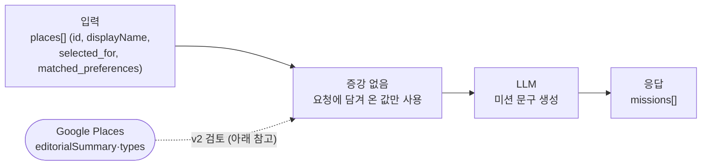
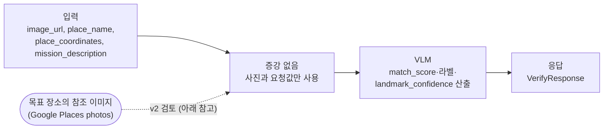

## 제출 항목

- 🚧 전체 데이터 흐름도(입력 -> 검색 -> 증강 -> 모델 응답/생성 결과)
- 🚧 사용 데이터/지식 소스 설명과 선택 이유(예: 이미지/영상 DB, 음성 데이터베이스, 텍스트 문서 등)
- 🚧 검색·임베딩·인덱싱 구현 내용과 모델 통합 방법(프롬프트 또는 입력 포맷)
- 🚧 컨텍스트 보강 도입 전후 예상 효과와 검증 계획, 혹은 도입이 불필요한 경우 그 이유

---

## 장소 추천 및 일정 생성

### 전체 데이터 흐름도

_(입력 → 검색 → 증강 → 응답)_

### 사용 데이터/지식 소스

사용 데이터/지식 소스
| 소스 | 선택 이유 |
| --- | --- |
| | |

### 검색·통합 구현 방식

_(임베딩·인덱싱을 쓰지 않는다면, Google API 자체가 검색 엔진 역할을 한다는 점을 명시)_

### 도입 효과 또는 불필요 사유

_(포토미션처럼 RAG가 불필요하면, "왜 불필요한지" 서술로 대체)_

## 포토 미션

### 전체 데이터 흐름도

**1) `photomissions/generate` — 미션 생성**



**2) `photomissions/{mission_id}/verify` — 사진 판정**



두 흐름 모두 **입력 → 모델 → 응답**으로 끝나고, 그 사이에 검색 단계가 없다. 점선은 보강을 넣는다면 들어갈 자리를 표시한 것이며, v1에서는 연결하지 않는다.

### 사용 데이터/지식 소스

| 소스 | 선택 이유 |
| --- | --- |
| **요청 본문의 값** (`place_name`, `matched_preferences`, `mission_description`, 사진) | 미션 생성·판정에 필요한 정보가 이미 요청에 담겨 온다. `matched_preferences`는 `place-selection` 단계에서 이미 계산된 값을 백엔드가 그대로 전달하는 것이라, 같은 정보를 다시 검색할 이유가 없다 |
| **별도 지식 베이스 없음** | 여행지 문서·이미지 DB를 구축하지 않는다. 아래 "불필요 사유" 참고 |
| (v2 검토) **Google Places `editorialSummary` / `types`** | 이미 `place-selection`에서 호출하는 API의 필드라, 새 데이터 소스를 만들지 않고도 장소 설명을 얻을 수 있다 |
| (v2 검토) **Google Places `photos`** | 목표 장소의 참조 이미지를 `place_id`로 바로 가져올 수 있다. 별도 이미지 DB 구축이 불필요하다 |

### 검색·통합 구현 방식

**임베딩·벡터 인덱스를 구축하지 않는다.** 검색 단계 자체가 없기 때문이다.

일반적인 RAG는 "무엇을 가져와야 하는지 모르는" 상태에서 질의와 가까운 문서를 임베딩 유사도로 찾는다. 포토미션은 그 전제가 성립하지 않는다.

- 미션을 만들 장소는 요청의 `places[]`에 **id로 지정돼 온다**
- 판정할 목표 장소도 요청의 `place_id`·`place_name`으로 **이미 특정돼 있다**

즉 무엇에 대한 정보가 필요한지가 처음부터 정해져 있어서, **찾는(retrieve) 문제가 아니라 가져오는(fetch) 문제**다. 나중에 보강을 도입하더라도 `place_id`로 Google Places를 호출하는 단순 조회면 충분하고, 벡터 검색이 끼어들 자리가 없다.

모델 통합 방식도 같은 이유로 단순하다. 보강 값을 쓰게 되면 프롬프트의 사용자 메시지에 한 줄을 더하는 형태가 된다.

```python
# 지금
user_prompt = (
    f"장소명: {place.displayName.text}\n"
    f"scope: {scope}\n"
    f"반영된 취향: {', '.join(place.matched_preferences) or '없음'}"
)

# 보강을 도입한다면 (v2 검토)
user_prompt += f"\n장소 설명: {place.editorial_summary}"
```

별도 리트리버나 체인 구성 없이 문자열 한 줄이 늘어나는 수준이므로, 이 역시 프레임워크를 도입할 이유가 되지 않는다.

### 도입 효과 또는 불필요 사유

#### `verify` — Visual RAG를 도입하지 않는 이유

목표 장소의 참조 이미지를 함께 넣어 "이 사진이 참조 이미지와 같은 곳인가"를 판정하는 방식이 Visual RAG의 전형이다. 이름과 달리 이건 검색(retrieve) 문제가 아니다. 목표 장소는 `place_id`로 이미 특정돼 있어 이미지 임베딩으로 후보를 찾을 필요 없이 바로 조회하면 된다. 도입해도 "RAG를 적용했다"보다 "입력에 참조 이미지를 하나 더 넣었다"에 가깝다.

**지금 넣지 않는 이유**

- **필요 여부를 아직 수치적으로 모른다.** 참조 이미지가 필요한 상황은 VLM이 그 장소를 몰라서 못 알아보는 경우인데, 그 비율을 측정한 적이 없다. 2단계 평가셋으로 랜드마크 인식 정확도를 재는 계획이 이미 있으므로, 측정 이후 필요할 때 도입한다.
- **넣으면 2단계에서 식별한 1순위 병목이 그대로 커진다.** `verify`의 최우선 병목은 이미지 인코딩(prefill)이고, 최적화 방향도 리사이즈로 입력 크기를 줄이는 쪽이었다. 참조 이미지 추가는 줄이려던 값을 배로 늘리는 선택이라, 화면 앞에서 기다리는 사용자에게 그대로 체감 시간이 된다.

#### `generate` — 보강이 유용할 수 있으나 v1에서는 보류

미션 문구의 품질은 모델이 그 장소를 아는지에 달려 있다. 4단계 프롬프트는 장소 이름만 반복하지 말고 담을 대상을 지정하라고 요구하는데,[예시1] 모델이 모르는 장소면 이 지시를 따를 수 없다. 덜 알려진 장소일수록 밋밋한 미션이 나오는 실패 양상이 예상된다.

Google Places `editorialSummary`나 `types`를 함께 넘기면 이 문제를 줄일 수 있고, 이미 호출하는 API의 필드라 새 데이터 소스도 필요 없다. 다만 v1에서는 도입하지 않는다.

**지금 넣지 않는 이유**

- **요청 스키마 변경이 따른다.** 1단계 `MissionPlace`에 필드가 늘어나고, 백엔드가 `place-selection` 응답에서 그 값을 함께 저장해 다시 전달해야 한다.
- **실패해도 정도가 약하다.** `generate`의 실패는 밋밋한 문구로 그치고 미션 자체가 잘못 판정되진 않는다. `verify`에서 같은 정보 부족은 판정 등급을 흔든다(위 Visual RAG 이유 참고). **두 엔드포인트의 보류 여부가 갈리는 것도 이 심각도 차이 때문이다.**

[예시1]: `대릉원에서 사진 찍기` → `대릉원의 능선이 이어지는 모습 담기`
