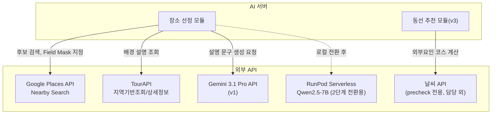

## 제출 항목

- 🚧 MCP(또는 대체 프로토콜)를 포함한 도구·서비스 통합 다이어그램, 각 도구/서비스의 역할과 호출 목적
- 🚧 상용 API 사용 시, 선택한 API 목록과 사용 이유, 비용·성능·제약 조건 분석, 그리고 내부 모듈화 계획
- 🚧 MCP를 도입하지 않는 경우에는 API 호출을 포함한 현재 인터페이스 설계와 확장 계획
- 🚧 선택한 통합 방법이 팀 서비스의 확장성·유지보수성·비용 효율성에 미치는 영향에 대한 설명

---

## 장소 추천 및 일정 생성

### 통합 다이어그램



Google Places는 실재 장소 데이터와 카테고리 필터링을 위해, TourAPI는 리뷰를 대체할 신뢰 가능한 배경 설명(RAG 근거)을 위해, LLM API는 취향 판정 등 결정론 처리 후 유일하게 남은 생성형 작업(설명 문구)을 위해 각각 호출함. 날씨 API는 동선 추천(v3)의 외부요인 코스 계산에 쓰이나 이 담당 범위 밖(precheck 담당)이라 다이어그램에만 표시함.

### 상용 API 목록 및 분석

**상용 API 목록 및 분석**
| API | 사용 이유 | 비용/성능/제약 | 캐싱·Fallback 전략 |
|---|---|---|---|
| Google Places API | 실재 장소 데이터 확보, type 기반 카테고리 필터링 | 호출당 과금(정확 단가 미확인, 남은 확인 사항). 응답 지연은 prefill 구간이라 파이프라인 병목 아님 | **place_id만 캐싱 가능**(그 외 필드 캐싱은 정책 위반, 재검토 대상). 응답 실패 시 재시도 정책 미정(남은 확인 사항) |
| TourAPI | 국내 관광지 공식 배경 설명, RAG 근거 확보 | 무료(공공데이터). 일부 장소에 `overview` 필드 누락 이슈 확인됨 | Fallback: overview 없음 → Google editorialSummary → 결정론 데이터만 |
| Gemini 3.1 Pro API(v1) | 설명 문구 생성, GPU 인프라 불필요 | 약 6원/회(N=8 기준), 컨텍스트 1M 토큰, 출력 최대 64K, **초기 인프라 구축비 없음**, 3주 예산(60,000원) 대비 약 1,000원 소요 | 캐싱 대상 아님(매번 다른 장소·취향 조합이라 재사용 불가) |
| RunPod Serverless Flex(2단계) | 로컬 모델(Qwen2.5-7B) 전환 후 GPU 대체 | 약 8.24원/회(콜드스타트 포함, 최대 28.5초), **초기 인프라 구축비 없음**(서버리스), 3주 예산 대비 약 1,384원 소요, 실제 예상 트래픽 대비 **약 43~86배 여유** | 콜드 스타트 완화를 위해 동적 배치(대기창 50~200ms) 적용 예정 |

### MCP 도입 여부와 근거

**미도입 — REST 직접 호출로 진행**

담당 범위에서 실제 호출하는 외부 API가 3~4개(Google Places, TourAPI, LLM API, 날씨 API)로 많지 않고, 각 API의 호출 패턴이 이미 결정론적으로 고정돼 있어 MCP가 주는 이점(동적 도구 탐색, 범용 연결)이 크지 않다고 판단함. 서비스 규모에 맞지 않는 과설계를 피하는 방향으로, REST 직접 호출을 유지함.

**MCP 도입 여부와 근거**
| 항목 | 처리 방식 |
|---|---|
| 예외 처리 | Google Places·TourAPI 매칭 실패 시 표5단계 Fallback 우선순위로 대체 |
| 재시도 | Google Places 응답 실패 시 재시도 정책 미정(남은 확인 사항) |
| 속도 제한 | 동적 배치(50~200ms 대기창)로 요청을 묶어 처리, 콜드 스타트·API 호출 빈도 완화 |

### 확장성 계획

확장성 계획
| 시나리오 | 대응 |
|---|---|
| 신규 지역(E_Region) 추가 | region 좌표 상수 목록에 추가만 하면 후속 로직(Nearby Search, TourAPI 매칭) 자동 적용 |
| 신규 외부 API 추가(예: 혼잡도 예측 API) | 동선 추천(v3)의 ExternalFactor 구조에 필드만 추가하면 확장 가능 |
| 로컬 모델 확정 후 API 완전 대체 | 프롬프트·입출력 스키마가 모델 독립적으로 설계되어 있어 모델 교체만으로 전환 가능(4단계 참고) |

---

### 외부 API 통합 도입 근거

**결론**: Google Places·TourAPI를 표준 REST 호출로 직접 연동(MCP 미도입). 비용은 API 방식이 압도적으로 유리하나, 캐싱 정책 위반이라는 예상 못 한 리스크가 확인되어 재설계가 필요한 상태.

---

**1. MCP 도입 여부 검토**

호출하는 외부 API가 많지 않고 호출 패턴이 고정적이라, 표준 프로토콜 계층이 주는 이점보다 구현 복잡도만 늘어난다고 판단해 REST 직접 호출을 유지함.

**2. GPU 인프라 vs API 비용 — 처음 우려와 실제의 격차**
| 단계 | 처음 우려 | 실제 확인 |
|---|---|---|
| GPU 상시 운영 | 3개월 160만 원 수준 초과 우려 | 서버리스 전환 시 3주 1,384원 수준 |
| API 사용 | 트래픽 늘면 종량제 비용 급증 우려 | 실제 예상 트래픽 기준 3주 1,000원 수준 |

두 방식 모두 처음 우려와 달리 예산에 전혀 부담이 안 됨을 확인함 — 최초 추정(예산으로 트래픽 역산)이 잘못된 방향이었음을 뒤늦게 발견하고, 시장 데이터 기반으로 재계산하는 방식으로 검증함.

**3. 캐싱 정책 — 설계 검증 중 발견된 예상 밖 리스크**

리뷰 텍스트 사용 가능 여부를 확인하는 과정에서, 기존 장소 캐싱 정책(24시간 TTL)이 Google 이용약관 위반 소지가 있다는 걸 우연히 발견함. "적발되지 않으면 괜찮지 않은가"라는 논의도 있었으나, 확률 문제가 아니라 계약(API 키 정지 시 서비스 전체 마비) 문제라는 점을 확인하고 정책 준수를 원칙으로 유지함. 즉시 재설계하지 않고 팀 논의 안건으로 명시적으로 남겨둠.

**4. 확장성 — 프롬프트·스키마를 모델 독립적으로 설계**

API(v1)에서 로컬 모델(2단계)로 전환이 이미 로드맵에 있었기에, 프롬프트와 입출력 스키마를 처음부터 특정 모델에 종속되지 않게 설계함. 이 덕분에 "API 사용 vs 자체 구축" 전환이 파이프라인 구조 변경 없이 가능함이 확인됨.

**5. 종합 원칙**

```
비용은 실측(시장 데이터, 실제 요금)으로 검증
프로토콜은 규모에 맞는 최소 복잡도로 선택
정책 위반 리스크는 발견 즉시 기록하고 별도 논의로 분리
```

### 남은 확인 사항

**남은 확인 사항**
| 항목 | 상태 |
|---|---|
| 캐싱 정책(표149) 재설계 | 팀 논의 필요, 미해결 |
| Google Places API 실제 단가 | 확인 필요 |
| Google Places 응답 실패 시 재시도 정책 | 미정 |

## 포토 미션

### 통합 다이어그램

_(어떤 외부 API를 왜 호출하는지 — Google Places, Google Maps, 날씨 API)_

### 상용 API 목록 및 분석

상용 API 목록 및 분석
| API | 사용 이유 | 비용/성능/제약 | 캐싱·Fallback 전략 |
| --- | --- | --- | --- |
| | | | |

### MCP 도입 여부와 근거

_(도입 안 한다면 REST 직접 호출 + 예외처리/재시도/속도제한을 어떻게 하는지)_

### 확장성 계획

_(새 외부 API 추가 시 어떻게 모듈화되어 있는지)_
