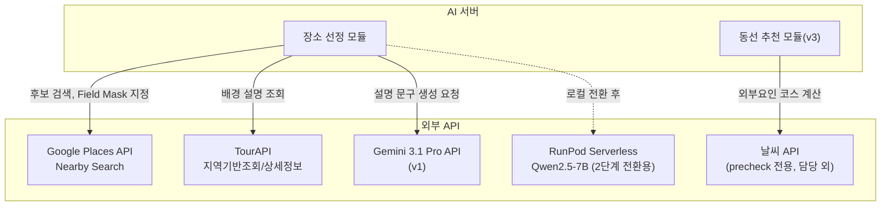
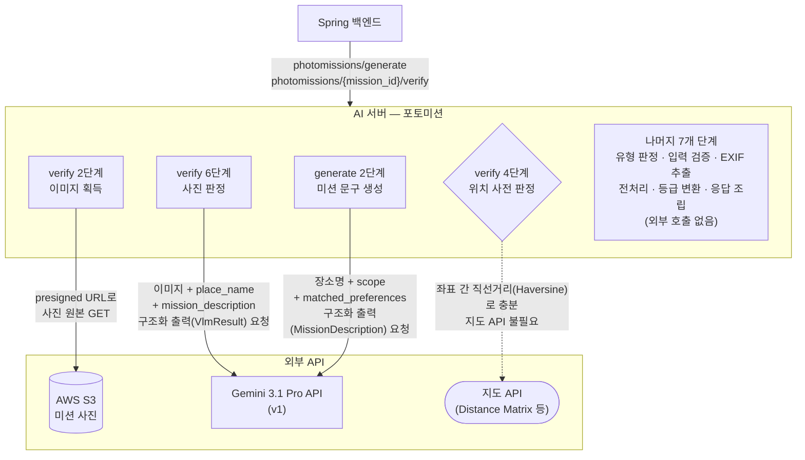

## 제출 항목

- ✅ MCP(또는 대체 프로토콜)를 포함한 도구·서비스 통합 다이어그램, 각 도구/서비스의 역할과 호출 목적
- ✅ 상용 API 사용 시, 선택한 API 목록과 사용 이유, 비용·성능·제약 조건 분석, 그리고 내부 모듈화 계획
- ✅ MCP를 도입하지 않는 경우에는 API 호출을 포함한 현재 인터페이스 설계와 확장 계획
- ✅ 선택한 통합 방법이 팀 서비스의 확장성·유지보수성·비용 효율성에 미치는 영향에 대한 설명

---

## 장소 추천 및 일정 생성

### 통합 다이어그램



Google Places는 실재 장소 데이터와 카테고리 필터링을 위해, TourAPI는 리뷰를 대체할 신뢰 가능한 배경 설명(RAG 근거)을 위해, LLM API는 취향 판정 등 결정론 처리 후 유일하게 남은 생성형 작업(설명 문구)을 위해 각각 호출함. 날씨 API는 동선 추천(v3)의 외부요인 코스 계산에 쓰이나 이 담당 범위 밖(precheck 담당)이라 다이어그램에만 표시함.

### 상용 API 목록 및 분석

**상용 API 목록 및 분석**
| API | 사용 이유 | 비용/성능/제약 | 캐싱·Fallback 전략 |
|---|---|---|---|
| Google Places API | 실재 장소 데이터 확보, type 기반 카테고리 필터링 | 호출당 과금(정확 단가 미확인, 남은 확인 사항). 응답 지연은 prefill 구간이라 파이프라인 병목 아님 | **place_id만 캐싱 가능**(그 외 필드 캐싱은 정책 위반, 재검토 대상). 응답 실패 시 재시도 정책 미정(남은 확인 사항) |
| TourAPI | 국내 관광지 공식 배경 설명, RAG 근거 확보 | 무료(공공데이터). 일부 장소에 `overview` 필드 누락 이슈 확인됨 | Fallback: overview 없음 → Google editorialSummary → 결정론 데이터만 |
| Gemini 3.1 Pro API(v1) | 설명 문구 생성, GPU 인프라 불필요 | 약 6원/회(N=8 기준), 컨텍스트 1M 토큰, 출력 최대 64K, **초기 인프라 구축비 없음**, 3주 예산(60,000원) 대비 약 1,000원 소요 | 캐싱 대상 아님(매번 다른 장소·취향 조합이라 재사용 불가) |
| RunPod Serverless Flex(2단계) | 로컬 모델(Qwen2.5-7B) 전환 후 GPU 대체 | 약 8.24원/회(콜드스타트 포함, 최대 28.5초), **초기 인프라 구축비 없음**(서버리스), 3주 예산 대비 약 1,384원 소요, 실제 예상 트래픽 대비 **약 43~86배 여유** | 콜드 스타트 완화를 위해 동적 배치(대기창 50~200ms) 적용 예정 |

### MCP 도입 여부와 근거

**미도입 — REST 직접 호출로 진행**

담당 범위에서 실제 호출하는 외부 API가 3~4개(Google Places, TourAPI, LLM API, 날씨 API)로 많지 않고, 각 API의 호출 패턴이 이미 결정론적으로 고정돼 있어 MCP가 주는 이점(동적 도구 탐색, 범용 연결)이 크지 않다고 판단함. 서비스 규모에 맞지 않는 과설계를 피하는 방향으로, REST 직접 호출을 유지함.

**MCP 도입 여부와 근거**
| 항목 | 처리 방식 |
|---|---|
| 예외 처리 | Google Places·TourAPI 매칭 실패 시 표5단계 Fallback 우선순위로 대체 |
| 재시도 | Google Places 응답 실패 시 재시도 정책 미정(남은 확인 사항) |
| 속도 제한 | 동적 배치(50~200ms 대기창)로 요청을 묶어 처리, 콜드 스타트·API 호출 빈도 완화 |

### 확장성 계획

확장성 계획
| 시나리오 | 대응 |
|---|---|
| 신규 지역(E_Region) 추가 | region 좌표 상수 목록에 추가만 하면 후속 로직(Nearby Search, TourAPI 매칭) 자동 적용 |
| 신규 외부 API 추가(예: 혼잡도 예측 API) | 동선 추천(v3)의 ExternalFactor 구조에 필드만 추가하면 확장 가능 |
| 로컬 모델 확정 후 API 완전 대체 | 프롬프트·입출력 스키마가 모델 독립적으로 설계되어 있어 모델 교체만으로 전환 가능(4단계 참고) |

---

### 외부 API 통합 도입 근거

**결론**: Google Places·TourAPI를 표준 REST 호출로 직접 연동(MCP 미도입). 비용은 API 방식이 압도적으로 유리하나, 캐싱 정책 위반이라는 예상 못 한 리스크가 확인되어 재설계가 필요한 상태.

---

**1. MCP 도입 여부 검토**

호출하는 외부 API가 많지 않고 호출 패턴이 고정적이라, 표준 프로토콜 계층이 주는 이점보다 구현 복잡도만 늘어난다고 판단해 REST 직접 호출을 유지함.

**2. GPU 인프라 vs API 비용 — 처음 우려와 실제의 격차**
| 단계 | 처음 우려 | 실제 확인 |
|---|---|---|
| GPU 상시 운영 | 3개월 160만 원 수준 초과 우려 | 서버리스 전환 시 3주 1,384원 수준 |
| API 사용 | 트래픽 늘면 종량제 비용 급증 우려 | 실제 예상 트래픽 기준 3주 1,000원 수준 |

두 방식 모두 처음 우려와 달리 예산에 전혀 부담이 안 됨을 확인함 — 최초 추정(예산으로 트래픽 역산)이 잘못된 방향이었음을 뒤늦게 발견하고, 시장 데이터 기반으로 재계산하는 방식으로 검증함.

**3. 캐싱 정책 — 설계 검증 중 발견된 예상 밖 리스크**

리뷰 텍스트 사용 가능 여부를 확인하는 과정에서, 기존 장소 캐싱 정책(24시간 TTL)이 Google 이용약관 위반 소지가 있다는 걸 우연히 발견함. "적발되지 않으면 괜찮지 않은가"라는 논의도 있었으나, 확률 문제가 아니라 계약(API 키 정지 시 서비스 전체 마비) 문제라는 점을 확인하고 정책 준수를 원칙으로 유지함. 즉시 재설계하지 않고 팀 논의 안건으로 명시적으로 남겨둠.

**4. 확장성 — 프롬프트·스키마를 모델 독립적으로 설계**

API(v1)에서 로컬 모델(2단계)로 전환이 이미 로드맵에 있었기에, 프롬프트와 입출력 스키마를 처음부터 특정 모델에 종속되지 않게 설계함. 이 덕분에 "API 사용 vs 자체 구축" 전환이 파이프라인 구조 변경 없이 가능함이 확인됨.

**5. 종합 원칙**

```
비용은 실측(시장 데이터, 실제 요금)으로 검증
프로토콜은 규모에 맞는 최소 복잡도로 선택
정책 위반 리스크는 발견 즉시 기록하고 별도 논의로 분리
```

### 남은 확인 사항

**남은 확인 사항**
| 항목 | 상태 |
|---|---|
| 캐싱 정책(표149) 재설계 | 팀 논의 필요, 미해결 |
| Google Places API 실제 단가 | 확인 필요 |
| Google Places 응답 실패 시 재시도 정책 | 미정 |

## 포토 미션

### 통합 다이어그램



점선은 실선(실제 호출)과 구분해 "연결되지 않는 대상"을 표시한다. 5단계 다이어그램에서 이 표기는 "고려했지만 v1에서는 보류"를 뜻했지만, 여기서는 의미가 다르다 — 지도 API는 보류가 아니라 **처음부터 필요 없다**는 확정적 결론이다(아래 "호출하지 않는 것과 그 이유" 표 참고). 4단계의 위치 사전 판정이 명백한 불일치를 걸러내면, 지도 API 없이 조기 반려로 끝난다.

**각 외부 호출의 역할과 목적**

| 호출 지점        | 대상             | 목적                                                                                                                 |
| ---------------- | ---------------- | -------------------------------------------------------------------------------------------------------------------- |
| `verify` 2단계   | AWS S3           | 백엔드가 만들어 준 presigned URL로 판정할 사진을 가져온다. AI 서버는 AWS 자격증명을 갖지 않고 HTTP GET만 한다        |
| `verify` 6단계   | Gemini API (VLM) | 사진이 미션대로 찍혔는지 판정한다. `match_score`·인식 라벨·`landmark_confidence`·재촬영 힌트를 한 번의 호출로 받는다 |
| `generate` 2단계 | Gemini API (LLM) | 장소·유형·취향을 받아 미션 문구를 생성한다                                                                           |

**호출하지 않는 것과 그 이유**

| 호출하지 않는 것              | 이유                                                                                                                                  |
| ----------------------------- | ------------------------------------------------------------------------------------------------------------------------------------- |
| 지도 API (Distance Matrix 등) | `verify` 4단계의 위치 판정은 두 좌표 간 직선거리로 "명백한 불일치"만 가리면 되므로 Haversine 공식으로 충분하다. 도로 거리가 필요 없다 |
| 별도 Vision/라벨 검출 API     | VLM 하나가 판정과 라벨 추출을 함께 하므로 서비스를 추가할 이유가 없다(4단계 "객체 탐지 → 특징 추출 → 분류 형태가 아닌 이유" 참고)     |
| 문화재·관광 정보 API          | 랜드마크 설명(`fact`)을 v1에서 제거하면서 필요가 없어졌다                                                                             |
| 벡터 DB / 검색 엔진           | 검색 단계가 없다(5단계 참고)                                                                                                          |

### 상용 API 목록 및 분석

| API                          | 사용 이유                                                                                                                                                 | 비용/성능/제약                                                                                                                                                                                                                                                                | 캐싱·Fallback 전략                                                                                                                                                                                                                                                                                                                                                |
| ---------------------------- | --------------------------------------------------------------------------------------------------------------------------------------------------------- | ----------------------------------------------------------------------------------------------------------------------------------------------------------------------------------------------------------------------------------------------------------------------------- | ----------------------------------------------------------------------------------------------------------------------------------------------------------------------------------------------------------------------------------------------------------------------------------------------------------------------------------------------------------------- |
| **Gemini 3.1 Pro** (VLM·LLM) | 2단계에서 팀 단위로 채택한 모델. 포토미션도 같은 구독을 쓴다. 텍스트 생성과 이미지 판정을 한 provider로 처리해 인증·SDK가 하나로 끝난다                   | **비용**: 입력 $2/M, 출력 $12/M<br>**성능**: 2단계에서 이미지 인코딩(prefill)을 1순위 병목으로 식별<br>**제약**: 부트캠프 지원으로 **구독 1개**만 사용 가능. 금액 제한 존재                                                                                                   | **캐싱**: `verify`는 매 요청 사진이 달라 응답 캐싱이 불가능하다. `generate`는 같은 장소에 유사한 미션이 반복될 수 있어 캐싱 여지가 있으나, 2단계에서 후순위(3순위)로 분류돼 실측 전이므로 v1에서는 도입하지 않는다<br>**Fallback**: 모델 호출이 실패하거나 판정이 반복 실패할 때의 처리를 미리 정해놓았기 때문에, AI 서버는 실패를 정직하게 반환하기만 하면 된다. |
| **AWS S3** (presigned GET)   | 사진이 S3에 저장되고 백엔드 DB에는 object 키만 남는다. 백엔드가 요청 시점에 presigned URL을 만들어 주므로 AI 서버는 AWS SDK·자격증명 없이 GET만 하면 된다 | **비용**: 다운로드 트래픽 비용은 백엔드 인프라 예산에 포함<br>**성능**: 서버 간 통신이라 빠를 것으로 예상하나, 원본 해상도가 크면 무시할 수 없어 2단계에서 실측 대상으로 잡았다<br>**제약**: presigned URL은 만료가 있다. AI 서버는 요청 즉시 가져오므로 짧은 만료로 충분하다 | **캐싱**: 같은 사진을 다시 판정하는 흐름이 없어 불필요<br>**Fallback**: 다운로드 실패 시 502로 반환해 백엔드가 재시도 정책에 따라 처리한다                                                                                                                                                                                                                        |

| 상황                          | 화면                                                      | AI 서버가 할 일                                                                                                                             |
| ----------------------------- | --------------------------------------------------------- | ------------------------------------------------------------------------------------------------------------------------------------------- |
| `generate` 호출 실패          | `예외) 미션 만들기 실패`                                  | 5xx 반환. 사전 생성 콘텐츠로 대체하지 않는다 — 미션은 동선에 맞춰 만들어야 의미가 있어, 무관한 미션을 내놓는 것보다 실패를 알리는 편이 낫다 |
| `verify` 판정이 3회 연속 실패 | `04-3` — "계속 인식이 안 되네요" + **직접 완료 처리하기** | 아무것도 하지 않는다. 재시도 횟수는 백엔드가 세고, 한도를 넘으면 AI를 호출하지 않는다(`MISSION_PHOTO_RETRY_LIMIT_EXCEEDED`)                 |
| 모델 응답이 스키마를 벗어남   | —                                                         | 서버 내부에서 재시도한 뒤에도 실패하면 500 반환. 재시도 횟수는 로그에 남긴다                                                                |

**사용자에게 남는 경로가 항상 있다**는 점이 중요하다. `verify`가 끝내 판정하지 못해도 사용자는 직접 완료 처리로 미션을 끝낼 수 있으므로, 모델 실패가 여행 경험을 막지 않는다.

#### 자체 모델 구축 vs API 사용

2단계에서 이미 다룬 내용이라 여기서는 결론만 옮긴다. v1은 상용 API로 시작하고, `photomissions/verify`를 로컬 전환 1순위(Qwen2.5-VL-7B)로 둔다. 전환 시점은 두 조건으로 판단한다.

- 평가셋 기준 정확도가 프론티어 대비 허용 범위에 들어올 것
- 손익분기 호출량을 넘길 것 — 상용 API는 호출당 과금이고 자체 서빙은 GPU 고정비라, 두 비용이 같아지는 지점을 기준으로 본다

### MCP 도입 여부와 근거

**도입하지 않는다.** 세 가지 이유다.

**1. 모델이 도구를 호출하는 구조가 아니다.**

MCP는 AI 모델이 외부 도구·데이터 소스를 표준화된 방식으로 **스스로 호출**하게 해주는 프로토콜이다. 포토미션의 모델 호출은 단방향이다 — 프롬프트와 이미지를 넣고 구조화된 출력을 받으면 끝이고, 모델이 중간에 무언가를 조회하거나 도구를 고르는 루프가 없다. 무엇을 언제 호출할지는 전부 파이프라인 코드가 정한다(4단계 참고).

**2. 표준화할 도구가 사실상 하나다.**

외부 호출이 Gemini와 S3 둘뿐이고, S3는 단순 HTTP GET이다. 도구가 여럿이고 이질적일 때 표준 인터페이스가 값을 하는데, 지금은 그 조건이 아니다. 프로토콜 계층을 얹어 얻는 것보다 관리할 구성 요소가 느는 비용이 크다.

**3. 계측에 불리하다.**

2단계에서 TTFT/decode를 스트리밍 응답에서 분해해 재기로 했다. 추상화 계층이 하나 끼면 원본 스트림을 다루기 번거로워진다. 4단계에서 LangChain을 쓰지 않기로 한 것과 같은 이유다.

**대신: REST 직접 호출과 그 관리 방식**

MCP 없이 SDK·HTTP로 직접 호출하되, 외부 호출에 필요한 처리는 파이프라인 단계 안에서 담당한다.

| 항목          | 처리 방식                                                                                                                              | 관련 규약                                                |
| ------------- | -------------------------------------------------------------------------------------------------------------------------------------- | -------------------------------------------------------- |
| **예외 처리** | 외부 호출 실패를 원인별로 다른 상태 코드로 변환한다. 어느 하류가 실패했는지 응답에 명시한다                                            | 1단계 오류 표 — S3/모델 호출 실패 502, 모델 타임아웃 504 |
| **재시도**    | 구조화 출력 파싱 실패 시 서버 내부에서 재시도한다. 정해진 횟수를 넘으면 500으로 반환하고 재시도 횟수는 로그에 남긴다                   | 2단계 "구조화 출력 1차 성공률" 지표와 연결               |
| **속도 제한** | rate limit 초과는 429로 반환하며 `Retry-After` 헤더를 붙인다. 동시 요청이 몰릴 때는 2단계의 동적 배치(대기창 50~200ms)로 호출을 묶는다 | 1단계 오류 표, 2단계 최적화 기법                         |
| **타임아웃**  | 모델 호출에 타임아웃을 걸고 초과 시 504로 반환한다. 구체적 값은 2단계 baseline 측정 후 확정한다                                        | 2단계 측정 계획                                          |

**사용자 판정 재시도와 서버 내부 재시도는 다른 층이다.** 위 표의 "재시도"는 모델 응답이 스키마를 벗어났을 때 서버가 알아서 다시 부르는 것이고, 사용자가 사진을 다시 찍어 올리는 재시도는 백엔드가 횟수를 세어 관리한다. 둘을 섞지 않는다.

### 확장성 계획

**4단계에서 단계별로 쪼갠 구조가 그대로 확장 지점이 된다.** 새 외부 API를 붙일 때 어느 단계에 들어가는지가 명확하고, 그 단계 함수 하나만 바뀐다.

| 앞으로 생길 수 있는 요구                              | 들어갈 자리                                  | 영향 범위                                                      |
| ----------------------------------------------------- | -------------------------------------------- | -------------------------------------------------------------- |
| 판정 정확도가 부족해 참조 이미지 도입 (5단계 v2 검토) | `verify` 5단계와 6단계 사이에 조회 단계 추가 | 새 단계 하나 + 6번 입력. 1~4번, 7~8번은 그대로                 |
| 미션 문구 품질을 위해 장소 설명 보강 (5단계 v2 검토)  | `generate` 2단계 입력                        | 프롬프트 사용자 메시지에 한 줄 추가                            |
| 모델 provider 교체 (Gemini → 자체 서빙)               | `verify` 6단계, `generate` 2단계             | 모델 호출 함수 2개. 나머지 단계는 입출력이 같아 무영향         |
| 저장소 교체 (S3 → 다른 것)                            | `verify` 2단계                               | 이미지 획득 함수 하나. AI 서버가 AWS에 묶여 있지 않아 가능하다 |

확장이 쉬운 이유는 프로토콜을 표준화해서가 아니라, **각 단계가 한 가지 책임만 지고 정해진 입출력으로 이어져 있어서**다. 새 호출이 생겨도 그 단계의 입력을 만들고 출력을 다음 단계 형식에 맞추면 되고, 나머지 단계는 무엇이 바뀌었는지 알 필요가 없다.

**MCP가 필요해지는 조건도 정해둔다.** 아래 중 하나라도 해당하면 그때 다시 검토한다.

- 모델이 여러 도구 중 무엇을 쓸지 **스스로 고르는** 흐름이 생길 때
- 외부 도구가 네다섯 개 이상으로 늘고, 인증·오류 처리 방식이 서로 달라 공통화 이득이 생길 때
- 같은 도구를 여러 팀·여러 서비스가 공유해야 할 때 (예: `trips` 계열과 같은 외부 API를 쓰게 되는 경우 — 위 각주 참고)

### 통합 방식이 서비스에 미치는 영향

| 관점            | 영향                                                                                                                                                                                                            |
| --------------- | --------------------------------------------------------------------------------------------------------------------------------------------------------------------------------------------------------------- |
| **확장성**      | 프로토콜이 아니라 단계 분리로 확보했다. 새 API를 붙일 때 바뀌는 코드가 한 단계로 한정되고, 나머지 단계는 재검증이 필요 없다                                                                                     |
| **유지보수성**  | 외부 의존이 Gemini와 S3 둘뿐이라 장애 원인을 좁히기 쉽다. 오류 응답에 어느 하류가 실패했는지 명시하도록 해, 로그를 보지 않고도 1차 분류가 된다                                                                  |
| **비용 효율성** | 지도 API·Vision API·벡터 DB를 쓰지 않아 호출당 과금 대상이 모델 하나로 줄었다. 비용이 한 축에 모여 있어 2단계 최적화(리사이즈로 입력 토큰 축소, GPS 조기 반려로 호출 자체 제거)가 그대로 비용 절감으로 이어진다 |
| **위험**        | 모델 provider 한 곳에 의존이 집중된다. 다만 4단계에서 모델 호출을 단계 함수 안에 격리해둬, 장애나 정책 변경 시 교체 범위가 두 함수로 한정된다                                                                   |
