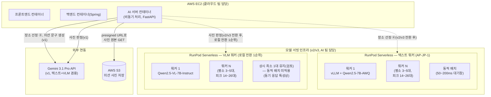

## 제출 항목

- ✅ 확장성을 고려한 배포 아키텍처 다이어그램(예: 여러 모델 서비스 인스턴스와 로드밸런서 구성, 오토스케일링 정책 등)
- ✅ 사용한 인프라 기술 및 서비스 명세(Docker, k8s, AWS/GCP 등 클라우드 자원, 혹은 On-premise 환경 설정 등 구체적으로)
- ✅ 모니터링 대상 지표 목록과 수집/시각화 방법(예: 응답 시간, Throughput, 에러 로그 등과 Grafana 대시보드 구성안)
- ✅ 간이 부하 테스트 또는 시뮬레이션 결과(가능하다면)와 그에 따른 시스템 자원 사용량/응답시간 변화 분석
- ✅ 제안한 인프라/모니터링 설계가 팀 서비스의 향후 성장과 안정적 운영에 어떻게 기여하는지에 대한 설명(예: '사용자 100배 증가 시에도 대응 가능하도록 OOO을 구성하여 서비스 중단 없이 확장 가능')

---

### 배포 아키텍처 다이어그램



### 배포 단위

배포 단위
| 구성 요소 | 배포 위치 | 처리 방식 |
|---|---|---|
| AI 서버 | AWS EC2, Docker 컨테이너 | 비동기(async) 처리, FastAPI |
| 모델 서빙 — 텍스트(장소 선정) | RunPod Serverless(AP-JP-1) | vLLM + Qwen2.5-7B-AWQ, 동적 배치로 콜드스타트 완화 |
| 모델 서빙 — VLM(포토미션 판정) | RunPod Serverless | Qwen2.5-VL-7B-Instruct, 로컬 전환 1순위, 동적 배치 미적용(동기 응답 특성상 대기 자체가 지연으로 체감) |
| 이미지 저장 | AWS S3 | presigned URL 방식, AI 서버는 자격증명 없이 GET만 수행 |

**로컬 전환 우선순위 근거**: verify(사진 판정)는 사용자가 화면을 보며 결과를 기다리는 동기 엔드포인트라 지연에 가장 민감함. 장소 선정(30초 허용)보다 먼저 로컬 모델로 전환.

**VLM 워커의 콜드스타트 대응 차이**: 텍스트 워커는 동적 배치로 완화 가능하나, VLM은 배치 대기 자체가 즉시성을 해쳐 적용이 어려움 — 상시 최소 1대 유지 등 별도 완화책이 필요하며, 이는 비용과 지연 사이의 추가 트레이드오프로 남아 **검토 필요** 항목으로 명시함.

### 오토스케일링 정책

**결론**: 텍스트 워커·VLM 워커 모두 평소 max workers 3~5대, 성수기+시뮬레이션 동시 실행 시 14~26대. 단, VLM 워커는 실시간성 제약이 더 엄격해 로컬 전환 우선순위가 높음.

상황 및 근거
| 워커 | 평소 max workers | 성수기+시뮬레이션 피크 | 비고 |
|---|---|---|---|
| 텍스트(장소 선정) | 3~5대 | 14~26대 | 시뮬레이션 24시간 분산 실행으로 평소 수준 유지 |
| VLM(사진 판정) | 3~5대 | 14~26대 | 동일 트래픽 가정 적용. 실시간성 제약(동기 응답 필수)으로 콜드스타트 영향이 텍스트보다 크게 체감됨 |

**콜드 스타트 영향 차이**: 텍스트 워커는 30초 대기 허용(표872)이라 콜드스타트(11~28초)가 상대적으로 수용 가능하나, VLM 워커는 사용자가 화면을 보며 즉시 결과를 기다리는 구조(표1076)라 같은 콜드스타트 시간이 이탈로 이어질 위험이 더 큼 — 이것이 VLM을 로컬 전환 1순위로 두는 근거와 연결됨.

**동적 배치 적용 여부**: 텍스트 워커는 동적 배치(50~200ms 대기창)로 콜드스타트 완화 가능하나, VLM(verify)은 사용자가 결과를 즉시 기다리는 동기 엔드포인트라 **배치 대기 자체가 지연으로 체감**되어 적용하기 어려움 — 별도의 완화책(예: 사전 워밍업, 상시 최소 1대 유지) 검토 필요.

### 인프라 기술 명세

#### 사용 기술 스택

결론: 텍스트·VLM 워커 모두 RunPod Serverless(AP-JP-1) + vLLM + AWQ 양자화로 통일. GPU는 A4000급(텍스트)과 더 큰 VRAM이 필요한 VLM용 GPU로 이원화.

| 계층                   | 텍스트 워커(장소 선정)      | VLM 워커(포토미션)                                                       |
| ---------------------- | --------------------------- | ------------------------------------------------------------------------ |
| 모델                   | Qwen2.5-7B-Instruct-AWQ     | Qwen2.5-VL-7B-Instruct-AWQ(4bit)                                         |
| 서빙 엔진              | vLLM                        | vLLM(neuralmagic 등 공식 양자화 버전 존재, w4a16/w8a8 지원 확인)         |
| VRAM 요구량            | 약 5.7~8.1GB                | 약 8~12GB(추정) — 이미지 인코딩·비전 인코더 추가로 텍스트 전용보다 더 큼 |
| GPU 모델               | A4000급(16~20GB)            | A5000급 이상 검토 필요(24GB, VRAM 여유 확보)                             |
| 제공업체·리전·결제방식 | RunPod, AP-JP-1, Serverless | 동일                                                                     |

#### VRAM 산정 근거

```
[텍스트 워커]
모델 가중치(AWQ 4bit): 약 4.5~5GB
KV 캐시: 약 0.2~1.1GB
오버헤드: 약 1~2GB
합계: 약 5.7~8.1GB

[VLM 워커] — 잠정치, 실측 필요
모델 가중치(AWQ 4bit): 약 4.5~5GB(텍스트와 유사)
비전 인코더 + 이미지 토큰 처리: 추가 약 2~4GB(이미지 해상도에 따라 변동)
KV 캐시: 약 0.2~1.1GB
오버헤드: 약 1~2GB
합계: 약 8~12GB(잠정치)
```

#### 외부 연동

외부 연동
| 대상 | 용도 | 담당 워커 |
|---|---|---|
| Google Places API | 후보 장소 검색 | 텍스트 워커 |
| TourAPI | 배경 설명(RAG 근거) | 텍스트 워커 |
| AWS S3 | 미션 사진 원본 저장, presigned URL로 획득 | VLM 워커 |

#### 배포 절차 (공통)

```
1. 핸들러 작성 — RunPod 공식 vLLM 워커 저장소 기반(텍스트·VLM 각각 별도 핸들러)
2. Dockerfile 작성 — vLLM + 각 모델(AWQ) 지정
3. Docker 이미지 빌드·레지스트리 푸시
4. RunPod 콘솔에서 Serverless 엔드포인트 등록(AP-JP-1 리전, 텍스트/VLM 별도 엔드포인트)
5. 표준 API 호출: POST https://api.runpod.ai/v2/{endpoint_id}/run
```

#### 대안 검토 및 기각 사유

대안 검토 및 기각 사유
| 대안 | 기각 사유 |
|---|---|
| GGUF + 커스텀 핸들러(텍스트·VLM 공통) | 커뮤니티 구현체 버그 다수, vLLM+AWQ가 RunPod 공식 지원 경로 |
| VLM에 텍스트와 동일 GPU(A4000) 사용 | VRAM 부족 가능성 — 이미지 인코딩 추가 부하 미반영 시 OOM 위험 |
| GPU 직접 구매 | 초기 비용·관리 부담 과다 |
| 하이퍼스케일러 | 네오클라우드 대비 70~80% 비쌈 |
| GPU 마켓플레이스(Vast.ai) | 서버리스 미지원, 다운타임 위험 |

#### 확인 필요 사항

확인 필요 사항
| 항목 | 상태 |
|---|---|
| AP-JP-1 리전 A4000급·VLM용 GPU 실제 재고 | RunPod 콘솔 실접속 확인 필요 |
| VLM VRAM 정확치 | 잠정치, 실측 필요(이미지 해상도·배치 크기에 따라 변동 큼) |
| VLM용 GPU 사양(A5000급 이상) 최종 확정 | 실측 VRAM 확인 후 결정 |

### 모니터링 지표 및 시각화

#### 결론

응답시간(prefill/decode 분리), 콜드스타트율, 워커 수, GPU 사용률을 핵심 지표로 삼고 Grafana 대시보드로 시각화. VLM 워커는 텍스트 워커 대비 이미지 인코딩 관련 지표를 추가.

#### 공통 지표(텍스트·VLM)

공통 지표(텍스트·VLM)
| 지표 | 수집 방법 | 임계치 |
|---|---|---|
| 응답시간(prefill) | RunPod 응답 스트림에서 첫 토큰까지 시간(TTFT) 측정 | 실측 전 미정, baseline 측정 후 확정 |
| 응답시간(decode) | 스트리밍 응답에서 토큰 생성 간격 측정 | 텍스트: 30초 이내(사용자 대기 허용치), VLM: 더 엄격(동기 응답, 구체 값 실측 필요) |
| 콜드스타트 발생률 | 워커 기동 로그에서 cold/warm 구분 카운트 | 낮을수록 좋음, 목표치는 동적 배치 적용 후 재산정 |
| 워커 수(현재 활성) | RunPod 콘솔/API의 워커 상태 조회 | 평소 3~5대, 피크 14~26대 초과 시 알림 |
| GPU 사용률 | RunPod 메트릭 API 또는 nvidia-smi 기반 수집 | 실측 전 미정 |
| VRAM 사용률 | 동일 | 텍스트: 5.7~8.1GB 기준, VLM: 8~12GB 기준 초과 시 알림 |
| 에러율(5xx, 타임아웃) | AI 서버 로그, HTTP 상태 코드 집계 | 실측 전 미정 |
| 구조화 출력 파싱 성공률 | Pydantic 검증 실패 로그 카운트 | 실측 전 미정, 재시도 지표와 연결 |

#### VLM 워커 고유 지표

VLM 워커 고유 지표
| 지표 | 수집 방법 | 임계치 |
|---|---|---|
| 이미지 인코딩 시간(prefill 내 세부) | 이미지 전처리~인코딩 완료까지 시간 별도 계측 | 가장 큰 병목으로 예상되는 구간, baseline 측정 후 확정 |
| S3 다운로드 시간 | presigned URL GET 요청 응답 시간 | 실측 전 미정 |
| 위치 사전 판정 조기 반려율 | GPS 불일치로 VLM 호출 자체를 생략한 비율 | 높을수록 비용 절감 효과, 모니터링 목적(임계치 아님) |
| 등급 분포(success/retry/fail) | verify 응답 result 필드 집계 | retry 비율 급증 시 프롬프트·임계값 재검토 신호 |

#### 시각화 — Grafana 대시보드 구성안

```
대시보드 1: 트래픽 개요
- 워커 수(텍스트/VLM 각각), 시간대별 요청 수, 성수기 배수 대비 실제 배수

대시보드 2: 응답 성능
- TTFT/decode 시간 분포(P50/P95/P99), 콜드스타트 발생률 추이

대시보드 3: 자원 사용
- GPU/VRAM 사용률(텍스트/VLM 각각), 워커별 자원 사용 히트맵

대시보드 4: 오류·품질
- 에러율, 구조화 출력 파싱 실패율, VLM 등급 분포(success/retry/fail)
```

#### 수집 파이프라인

```
RunPod 워커(핸들러 코드 내 로깅) → 로그 수집(RunPod 기본 로그 또는 외부 로그 수집기)
→ Prometheus(메트릭 저장) → Grafana(시각화)
```

#### 확인 필요 사항

확인 필요 사항
| 항목 | 상태 |
|---|---|
| 각 지표의 구체적 임계치 | 대부분 실측 전이라 baseline 측정 후 확정 필요 |
| RunPod 메트릭 API가 GPU/VRAM 사용률을 직접 제공하는지 | 확인 필요, 제공 안 하면 핸들러 코드 내 자체 계측 필요 |
| Prometheus/Grafana를 직접 구축할지, RunPod 기본 로그로 대체할지 | 비용·운영 부담 대비 실효성 검토 필요 |

### 부하 테스트 결과

#### 결론

실제 부하 테스트는 아직 실행 전이며, 계획만 수립된 상태. k6(또는 Locust)로 max workers를 의도적으로 낮게 설정한 뒤 순간 트래픽을 발생시켜 오토스케일링·콜드스타트·큐잉 동작을 관찰할 예정.

#### 테스트 목적

테스트 목적
| 목적 | 내용 |
|---|---|
| 실운영 필요성과 별개 | 실제 예상 트래픽(하루 12~24회, 성수기 8배 반영해도 시간당 수십 건 수준)은 소규모 워커(3~5대)로 충분히 감당 가능함이 이미 계산으로 확인됨 |
| 학습·검증 목적 | 오토스케일링 한계 상황에서 시스템이 어떻게 반응하는지(워커 증설 속도, 큐잉, 요청 실패 양상)를 직접 관찰해 문서화 |

#### 테스트 계획

테스트 계획
| 단계 | 내용 |
|---|---|
| 1 | RunPod Serverless 엔드포인트의 max workers를 2~3대로 낮게 설정 |
| 2 | k6(또는 Locust)로 짧은 시간(예: 1분)에 50~100개 요청을 동시 발사 |
| 3 | 관찰 지표: 워커 증설까지 걸리는 시간, 콜드스타트로 인한 초기 지연, 큐 대기 건수·시간, 워커 수 초과 시 응답 코드(429 등) |
| 4 | 결과를 아래 표에 기록 |

#### 부하 테스트 결과

부하 테스트 결과
| 지표 | 측정값 | 비고 |
|---|---|---|
| 워커 증설 반응 시간 | | |
| 요청당 응답 시간(부하 전) | | |
| 요청당 응답 시간(부하 중) | | |
| 요청당 응답 시간(부하 후) | | |
| 실패·거부 요청 비율 | | |
| 큐 대기 시간(평균) | | |
| 큐 대기 시간(최대) | | |

#### 확인 필요 사항

확인 필요 사항
| 항목 | 상태 |
|---|---|
| 실제 테스트 실행 및 수치 확보 | 미실행, 스프린트 일정 내 별도 시간 확보 필요 |
| 텍스트 워커·VLM 워커 각각 별도 테스트 여부 | 두 워커의 트래픽 패턴·지연 민감도가 달라(VLM은 동기 응답) 개별 테스트 필요성 있음 |

### 성장 대응 근거

#### 결론

사용자 8배(실측 성수기 기준) 증가 시에도 오토스케일링(3~5대→14~26대)과 시뮬레이션 분산 실행 전략만으로 서비스 중단 없이 대응 가능. 그 이상 규모는 별도 검증 필요.

#### 트래픽 증가 시나리오별 대응

트래픽 증가 시나리오별 대응
| 증가 배수 | 근거 | 대응 방식 | 추가 인프라 필요 여부 |
|---|---|---|---|
| 1배(평소) | 도달 1,000명, 전환율 1.2% 기준 | max workers 3~5대로 처리 | 불필요 |
| 8배(성수기, 실측 기반) | 여행 앱 성수기 실측 증가율 사례(인천공항 스마트패스 약 8배) | max workers 14~26대까지 자동 확장(오토스케일링) | 불필요 — RunPod Serverless가 자동 대응 |
| 8배 + 시뮬레이션 동시 실행 | 가중치 학습용 페르소나 시뮬레이션 1,000~2,000건이 성수기와 겹치는 최악 시나리오 | 시뮬레이션을 24시간 분산 실행해 피크를 평소 수준(3~5대)으로 완화 | 불필요 — 실행 전략 조정만으로 해결 |
| 100배 이상 | 검토 안 됨 | 미확정 | AI 서버(EC2) 수평 확장 및 로드밸런서(클라우드 팀 담당 영역) 검토 필요 추정 |

#### 비용 관점의 성장 여력

비용 관점의 성장 여력
| 항목 | 값 |
|---|---|
| 3주 예산 | 60,000원 |
| 실제 예상 소요(메인 파이프라인, v1+v2) | 약 1,000~1,400원 |
| 예산 대비 여유율 | 약 43~86배 |

이 여유율은 트래픽이 상당히 증가해도 예산 측면에서는 병목이 되지 않음을 뜻함. 다만 이는 콜드스타트를 포함한 보수적 가정 기준이며, 워커 수 확장(14~26대)에 따른 재계산은 성수기 시나리오까지만 반영되어 있음.

#### 서버리스 아키텍처가 성장 대응에 기여하는 구조적 이유

서버리스 아키텍처가 성장 대응에 기여하는 구조적 이유
| 특성 | 성장 대응 기여 |
|---|---|
| scale-to-zero | 트래픽이 없을 때 비용이 발생하지 않아, 트래픽 규모를 과도하게 예측해 상시 인프라를 미리 구축할 필요가 없음 |
| 자동 오토스케일링 | 워커 수 상한(max workers)만 조정하면 되므로, 트래픽 증가에 따른 인프라 재설계 부담이 적음 |
| 모델 서빙과 API 서버(EC2)의 분리 | 트래픽 증가로 인한 확장 부담이 모델 서빙(RunPod) 쪽에 집중되어, 상대적으로 가벼운 API 서버(EC2)는 구조 변경 없이 유지 가능 |

#### 확인 필요 사항

확인 필요 사항
| 항목 | 상태 |
|---|---|
| 100배 이상 증가 시나리오 | 미검토, AI 서버(EC2) 확장 여부는 클라우드 팀과 협의 필요 |
| GPU 재고 한계(성수기 피크 시 실제로 14~26대까지 확보 가능한지) | RunPod 콘솔 실측 필요 |
| VLM 워커의 성장 대응 여력 | 텍스트 워커와 동일 가정 적용, 별도 검증 필요 |
