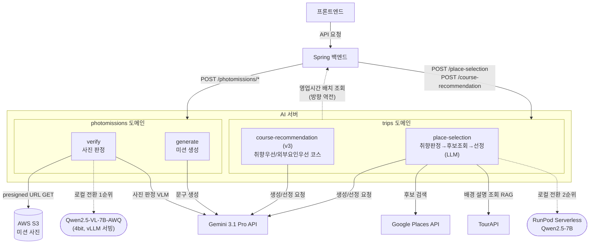

## 제출 항목
- ✅ 최종 통합된 서비스 아키텍처 다이어그램 및 설명 (이전에 제안된 설계 요소들이 모두 반영된 그림과 각 요소 설명)
- ✅ 단계별 설계 적용 결과 요약표 (각 단계의 주요 변경사항과 그에 따른 성능/품질 향상 요약)
- ✅ 현재 완성된 시스템의 성능/품질에 대한 평가 (가능한 경우 정량적 데이터 포함)
- ✅ 프로젝트 수행에 대한 회고 및 평가: 무엇을 배웠고 어떤 어려움이 있었는지, 이를 어떻게 해결했거나 해결하지 못했는지
- ✅ 앞으로의 개선 제안 및 계획: 추가 구현하고 싶은 기능이나 필요할 수 있는 최적화, 또는 다음 연구/개발 방향에 대한 제언
- ✅ 전반적인 결론으로, 현 시점에서 팀의 AI 모델 서빙 아키텍처가 왜 타당하고 적절한지에 대한 종합 의견

---

## 단계 8: 최종 통합 설계 및 회고

### 1. 최종 통합된 서비스 아키텍처 다이어그램 및 설명

**구성요소별 요약**

| 구성요소 | 역할 | 도입/유지 이유 |
|---|---|---|
| `place-selection` | 그룹 취향 기반 장소 선정 (①취향판정→②후보조회→③선정) | 1·3단계에서 정의한 스키마로 백엔드-AI 계약 확정. 4개 판단 중 3개가 결정론(수식·필터), LLM은 ③에서 후보 중 최종 선정에만 관여 |
| `course-recommendation` (v3) | 취향우선/외부요인우선 두 코스안 생성 | 최단거리(1안)는 Spring이 계산하므로 이 모듈 범위 밖. 코스 설명은 3종 고정 부제라 LLM 불필요(4단계) |
| `photomissions/generate` | 확정 동선 기반 사진 미션 문구 생성 | 문구·유형 생성(LLM)→응답조립(규칙) 2단계 분리 |
| `photomissions/verify` | 제출 사진의 미션 달성 여부 VLM 판정 | 8단계 파이프라인. GPS 조기 반려로 불필요한 VLM 호출 제거 |
| Gemini 3.1 Pro API | 팀 전체 LLM/VLM 공급자 | 2단계 실측 비교(Claude Sonnet 5 대비 속도 5배, 정확도 동등) 후 채택. `place-selection` 설명 생성 약 6원/회(N=8), `photomissions`도 동일 provider |
| TourAPI | `place-selection` RAG 근거 소스 | 국내 관광지 공식 배경 설명. 공공데이터라 저작권 부담 낮음. 무료 |
| Google Places API | 장소 후보 검색·배경 설명 보조(editorialSummary) | `place-selection`의 핵심 후보 소스. `photomissions`는 이 API를 직접 호출하지 않고 `place-selection` 응답을 재사용 |
| AWS S3 (presigned URL) | 미션 사진 저장소 | 백엔드가 짧은 만료의 presigned URL 발급, AI 서버는 자격증명 없이 GET만 수행 |
| **RAG (trips: 채택 / photomissions: 미도입)** | — | `place-selection`은 "설명 문구의 사실관계"가 검증 필요한 문제라 TourAPI 기반 RAG로 할루시네이션을 75~90% 줄임(실측 10.4% 근거). `photomissions`는 장소가 이미 요청에 특정돼 와서 "찾는 문제가 아니라 가져오는 문제"라 검색 단계 자체가 불필요 — 두 판단 모두 "이 문제에 검색이 실제로 필요한가"를 각자 다시 물은 결과다 |
| MCP (양쪽 다 미도입) | — | `photomissions`: 모델 호출이 단방향이고 도구 2개뿐이라 불필요. `trips`: 도구 3~4개(Google Places·TourAPI·Gemini·날씨)이고 호출 패턴이 고정적이라 불필요. 이유는 다르지만 "규모에 맞지 않는 과설계 회피"라는 판단축은 같음 |
| RunPod Serverless (trips 로컬 전환) / Qwen2.5-VL-7B (photomissions 로컬 전환) | 각 도메인 2단계에서 지정한 로컬 전환 대상 | `trips`: 콜드스타트 포함 약 8.24원/회, 예상 트래픽 대비 43~86배 여유 확인. `photomissions`: verify가 실시간 제약·GPU 부하 모두 커서 1순위 |

---

### 2. 단계별 설계 적용 결과 요약표

**trips (`place-selection`, `course-recommendation`)**

| 단계 | 주요 변경사항 | 성능/품질 효과 |
|---|---|---|
| 1단계 (API 설계) | `place-selection`/`course-recommendation`/`precheck` 스키마 확정. `survey_result`는 숫자 배열만 전달(문항 텍스트는 프론트 소유) | 정적/동적 데이터 분리 원칙으로 요청 크기 최소화. `preference_scores`로 멤버별 취향 반영률 계측 가능 |
| 2단계 (성능 최적화) | Gemini 3.1 Pro 채택(Sonnet 5와 실측 비교). 후보 캐싱·사전 필터링·구조화 출력·Few-shot 계획 | 모델 축 변수를 팀 전체에서 통일해 baseline 측정 단순화. `place-selection`/`course-recommendation`을 로컬 전환 2순위로 지정 |
| 3단계 (아키텍처 모듈화) | 장소 선정/동선 추천을 별도 모듈로 분리. AI↔Spring 역방향 인터페이스(영업시간 배치 조회) 명시 | GPU 필요 연산(취향판단·선정)과 불필요 연산(경로계산)을 서버 단위로 분리해 예산 안에서 자원 배분 최적화. 모델 교체 시 Spring 코드 무영향 확인(사례 1) |
| 4단계 (멀티스텝 파이프라인) | 장소 선정 4단계(취향판정→후보조회→슬롯선정→설명생성) 분리. 7개 취향 통합 방법 비교 후 G방법(평균−표준편차×w) 채택 — **팀원 기존안 대비 정확성 우위는 없고 구현 단순성이 실질 이유임을 스스로 명시**. LLM 필요성을 처음부터 재검증해 순위·균형·매칭 등은 전부 결정론 가능함을 확인, **유일하게 결정론 불가능한 지점(자연어 설명 창작)만 LLM 유지** | "재현성 필요=결정론, 표현 필요=생성형" 원칙으로 모델 호출을 1개 지점(④ 설명 생성)까지 좁힘. v3 코스는 설명 대상이 3종 고정이라 LLM조차 불필요 판정 — 같은 원칙을 다른 모듈에 기계적으로 복제하지 않음 |
| 5단계 (RAG) | **채택**. TourAPI(1순위)+Google editorialSummary(2순위)+결정론 데이터(폴백) 3단 구조. 리뷰는 저작권·attribution 요건으로 명시적 제외. 좌표100m+편집거리로 Google/TourAPI ID 체계 불일치 해결 | Gemini 3.1 Pro 실측 할루시네이션 10.4%를 근거로 도입 필요성 정량화. RAG 적용 시 75~90% 감소 기대(검증 계획: 표본 수동 검수, 실측치는 추후 채움) |
| 6단계 (외부 연동/MCP) | Google Places·TourAPI·Gemini·RunPod REST 직접 호출. MCP 미도입(도구 3~4개, 호출 패턴 고정) | GPU 상시운영 vs 실제 서버리스 비용(3주 1,384원) 격차를 실측으로 확인. |
| 7단계 | [작성 전] | — |

**포토미션 (`photomissions/*`)**

| 단계 | 주요 변경사항 | 성능/품질 효과 |
|---|---|---|
| 1단계 (API 설계) | `generate`/`verify` 입출력 스키마 확정. `message` 필드 제거, `reason`/`primary_category` 추가로 문구 조립 책임을 프론트로 이전 | AI가 모르는 정보(미션 카테고리)를 억지로 문구에 넣지 않아 환각 위험 제거. 스키마가 곧 Pydantic 검증 코드가 되어 계약 위반이 실행 시점에 걸러짐 |
| 2단계 (성능 최적화) | `verify`를 로컬 전환 1순위로 지정(실시간 제약·GPU 부하 모두 상). 병목을 이미지 인코딩(prefill)으로 특정 | 리사이즈·GPS 조기반려로 불필요한 고비용 VLM 호출을 원천 차단하는 방향으로 최적화 설계. baseline 측정 계획 수립(실측은 TBD) |
| 3단계 (아키텍처 모듈화) | `generate`를 문구·유형 생성(LLM)→응답조립(규칙) 2단계로 분리 | 판단 성격이 다른 작업을 한 함수에 섞지 않아, 규칙 부분은 모델 호출 없이 단위 테스트 가능 |
| 4단계 (멀티스텝 파이프라인) | `verify`를 8단계로 분리(입력검증→이미지획득→EXIF→위치사전판정→전처리→VLM판정→등급변환→응답조립). 오케스트레이터는 판단하지 않고 호출만 함 | GPS 조기반려 시 VLM 호출 자체가 생략되어 비용·latency 직접 절감. "한 단계는 한 가지만 판단한다" 원칙으로 재현성 있는 단위 테스트 가능 |
| 5단계 (RAG) | `generate`/`verify` 모두 v1에서는 **미도입** 결론 | "찾는 문제가 아니라 가져오는 문제"라는 근거로 불필요한 검색 인프라 도입을 피함. verify에 Visual RAG를 붙이면 2단계에서 잡은 1순위 병목(이미지 인코딩)이 배가되므로 도입 안 함 |
| 6단계 (외부 연동/MCP) | 호출 외부 서비스를 Gemini+S3 둘로 한정. MCP 미도입 | 의존 서비스가 적어 장애 원인 분리가 쉬움. 실패 시 프론트 와이어프레임에 이미 준비된 fallback(직접 완료 처리 등)으로 사용자 경로가 항상 남음 |
| 7단계 | [작성 전] | — |

---

### 3. 현재 완성된 시스템의 성능/품질 평가

#### trips
latency·정확도 실측은 아직 없으나(2단계 baseline 측정 계획 단계), **비용은 시장 데이터 기반으로 이미 계산됨**: Gemini 3.1 Pro API 약 6원/회(N=8 기준, 3주 예산 60,000원 대비 약 1,000원), RunPod Serverless(로컬 전환 후) 약 8.24원/회(콜드스타트 포함, 3주 예산 대비 약 1,384원, 예상 트래픽 대비 43~86배 여유). 처음에는 GPU 상시운영 시 3개월 160만원 초과를 우려했다. 실제 수치와 얼마나 격차가 나는지는 재계산으로 직접 확인했다.

#### 포토미션
v1 `generate`·`verify` 구현은 끝났지만, 2단계에서 계획한 baseline(평시/성수기 latency·throughput·랜드마크 인식 정확도)은 아직 측정 전이라 **정량 수치는 여전히 TBD**다. 지금까지 확인한 것은 다음과 같다.

- **코드 수준**: 규칙 단계 단위 테스트와 외부 호출(Gemini·S3) mock 테스트 57개를 작성해, 등급 경계값·에러 코드 매핑(429/502/504)·재시도 횟수를 검증했다.
- **정성 확인**: 팀원이 경주에서 직접 찍은 사진 3장으로 판정해봤다. 첨성대 사진 2장과 동궁과 월지 사진 1장은 각자의 미션에서 모두 success(`match_score` 90, `landmark_confidence` 95~100)가 나왔고, 동궁과 월지 사진을 첨성대 미션에 넣으면 fail(0점)이 나왔다. 두 장소는 1km도 떨어져 있지 않아 위치 조기 반려로는 걸러지지 않는 경우인데 VLM이 가려냈다. 다만 표본이 작고 운영 모델이 아닌 `gemini-3.1-flash-lite`로 본 결과라 정확도 지표로 쓸 수는 없다.
- **평가셋**: AI Hub "국내 여행로그 데이터"에서 첨성대·대릉원·동궁과월지·월정교 4곳의 사진 1,916장을 추렸다. `VISIT_AREA_ID`가 여행마다 재사용돼 사진이 엉뚱한 장소와 연결되던 오류를 찾아 `TRAVEL_ID`+`VISIT_AREA_ID` 복합키로 다시 매핑했다. 실제 이미지 내용 확인은 아직 못 해서, 이 데이터셋은 "확보"가 아니라 "검증 중인 후보"다.

---

### 4. 프로젝트 수행에 대한 회고 및 평가

**배운 점 — 포토미션**
- **"AI가 판단할 부분과 규칙이 정할 부분을 나누는 게 생각보다 어려웠다.** 재시도 횟수·안내 문구·랜드마크 노출 여부 등, 처음엔 AI에 맡길 뻔했던 판단들을 규칙/백엔드/프론트로 하나씩 옮겼다. 4단계 응답 조립 단계(build_response)에서 임계값 비교 로직이 오케스트레이터에 남아있던 걸 뒤늦게 발견해 고친 것도 같은 맥락이다.
- **환각 위험이 있는 기능은 편의보다 안전을 택함.** 랜드마크 상세 설명(`fact` 필드)을 v1에서 제거한 결정이 대표적이다. 화면상 매력적인 기능이었지만 검증 안 된 사실을 LLM이 생성하는 구조라 제거함.
- **유행하는 기술을 그대로 채택하지 않고 매번 "우리 문제에 필요한가"를 되물음.** LangChain/LangGraph, MCP, RAG 셋 다 명시적으로 불채택하고 그 근거를 남김.

**배운 점 — trips**
- **"이미 내린 결정도 끝까지 재검증한다."** 4단계에서는 애초에 LLM을 쓰기로 했던 첫 근거를 스스로 다시 따져 "재확인 결과 실체 없음"이라고 인정했다. 이 대목이 가장 인상적이다. 순위·균형·매칭 판단은 전부 결정론으로 가능하다는 걸 검증해, 모델 호출을 정말 필요한 지점(자연어 설명 창작) 하나로 좁혔다. 채택한 방법(G방법)조차 "정확성이 증명된 게 아니라 구현이 단순해서"라고 솔직히 남겼다.
- **RAG는 상황에 따라 채택될 수도, 안 될 수도 있다는 걸 팀 안에서 직접 확인함.** `place-selection`(RAG 채택)과 `photomissions`(RAG 미도입)이 같은 팀에서 정반대 결론에 이른 건 우연이 아니다. 각자 "이 문제에 검색이 실제로 필요한가"를 따로 물었고 그 결과가 이렇게 갈렸다.
- **API 제공 = 재사용 허가라는 전제가 틀렸음을 정책 원문 확인으로 발견.** Google Places 정책상 `place_id`만 캐싱 가능하고 그 외(리뷰 등)는 금지라는 걸 뒤늦게 확인했고, 기존 24시간 TTL 캐싱 정책이 위반 소지가 있다는 것도 이 과정에서 드러났다.

**어려움 — 팀 공통**
- PL 피드백에서 "취향 분석·장소 추천에 LLM이 정말 필요한가"라는 근본적 질문을 받음. **다만 이 질문은 4단계에서 이미 한 번 통과한 검증이다.** 당시 순위·균형·매칭은 전부 걷어내고 LLM은 자연어 설명 창작 하나에만 남기기로 정리했었다. 계산을 통해 결정론으로 대체 가능한 부분과 LLM이 남아야 하는 지점을 이미 구분해 둔 셈이라, PL 피드백의 취지에는 4단계 검증 과정이 근거가 된다. 다만 PL이 요구한 **"정량적 평가지표"**는 아직 없어, 추후 실제로 채워야 한다.

**해결하지 못한 것**
- latency·정확도 정량 지표가 두 도메인 다 없음(위 3번 참고).
- trips: 캐싱 정책(24시간 TTL) 관련 재설계 필요, 미해결. Google Places 실제 단가 재확인 필요. 응답 실패 시 재시도 정책 미정.
- 포토미션: `T_Preference` enum 최종 정의 미확정. 프론트엔드 안내 문구 16개 조합 실제 작성 여부 미확인.
- `trips/precheck`의 담당자가 6단계 문서에서 "담당 범위 밖"으로만 표시돼 있어 실제 소유자 재확인 필요.

---

### 5. 앞으로의 개선 제안 및 계획

**trips**
1. **PL이 요구한 "평가 가능한 지표" 마련**: AI Hub 데이터에 방문지별 만족도(`DGSTFN`)·재방문의향·추천의향 필드가 있다. 이걸로 "취향 기반 추천이 실제로 잘 됐는가"를 정량적으로 보여줄 골든셋/루브릭을 구축한다. PL 피드백에서 명시적으로 요구한 부분이라 우선순위 높음.
2. **캐싱 정책 재설계**. 24시간 TTL이 Google 이용약관 위반 소지가 있다는 5·6단계 공통 발견을 실제로 해소한다. `place_id` 외 필드는 캐싱하지 않는 방향으로 재작업 필요.
3. **G방법(취향 통합 공식)의 정확성 검증**. 현재 채택 근거가 "구현 단순성"뿐이다. 실제 사용자 데이터가 쌓이면 팀원 기존안과 정확성을 다시 비교.
4. Google Places 실제 단가·재시도 정책 확정.

**포토미션**
1. **AI Hub 실제 여행 사진으로 랜드마크 평가셋 구축**: 주소 일관성, 유형코드 필터, `TRAVEL_ID`+`VISIT_AREA_ID` 복합키 검증까지 진행한 상태다. 실제 이미지 내용 확인까지 마쳐 평가셋을 신뢰할 수 있게 완성하면 2단계 baseline 측정에 바로 투입한다.
2. **`verify`의 로컬 모델(Qwen2.5-VL-7B) 전환**. 평가셋 정확도가 확보되면 기존 계획대로 전환 시점 판단.
3. **임계값 상수 확정**: `LANDMARK_THRESHOLD`, `SUCCESS_THRESHOLD` 등을 실측 평가셋으로 확정.

---

### 6. 종합 결론

현재 팀의 AI 모델 서빙 아키텍처는 두 도메인(`trips`, `photomissions`) 모두 **"이 문제에 정말 필요한가를 먼저 묻고, 필요한 만큼만 쓴다"는 같은 원칙 위에 서 있다.** 다만 같은 원칙에서 두 도메인의 결론은 갈렸다. `place-selection`은 RAG를 채택했고 `photomissions`는 채택하지 않았다.

LLM 사용 범위에서도 `place-selection`은 이미 LLM을 쓰기로 했던 결정 자체를 4단계에서 재검증해, 결정론으로 가능한 판단(순위·균형·매칭)은 전부 걷어내고 자연어 설명 창작 한 곳에만 모델을 남겼다. `photomissions`도 규칙으로 답이 정해지는 판단(등급 변환, 카테고리 결정, GPS 판정)은 모델에 맡기지 않고, 문구 생성·사진 판정처럼 정말 판단이 필요한 지점에만 모델을 쓴다. MCP·LangChain 모두 두 도메인에서 각자의 이유로 불채택했다.

다만 이 타당성은 아직 **정량적으로 증명되지 않았다.** "이 설계가 실제로 더 나은 결과를 낸다"는 근거(평가지표)가 갖춰져야 완성도 있는 결론이 된다. trips는 비용 정량화까지는 마쳤으나 추천 품질 지표가 없고, 포토미션은 비용·정확도 둘 다 실측 전이다. 다음 단계의 최우선 과제는 기능 추가가 아니다. **확보 중인 실제 데이터로 평가 체계부터 완성 시, 이 아키텍처의 타당성을 숫자로 보일 수 있다.**
